# 自我介绍

面试官你好，我叫周鑫，18年毕业于东莞理工学院软件工程卓越计划专业；17年12月入职团贷网，现今3年工作经验，在北明担任Java高级开发工程师；20年通过阿里云云计算架构师ACE认证、Linux基金会与CNC联合的CKAD认证；最近在学习服务网格与Kuberenetes开发相关内容，希望能跟随新技术的脚步，在贵公司发挥我的能力，谢谢

# 设计

## 设计原则

* **开闭原则** 
  * 归纳：对扩展开发，对修改关闭
  * 目的：减少维护带来的新的风险
  
* **依赖倒置原则** 
  * 归纳：抽象不应该依赖细节；细节应该依赖抽象
  * 目的：更利于代码结构的升级扩展
  
* **单一职责原则**
  * 归纳：一个类只做一件事
  * 目的：便于理解，提高代码可读性

* **接口隔离原则**
  * 定义：客户端不应该依赖它不需要的接口；
  * 目的：功能解耦，高内聚，低耦合
  
* **迪米特法则**
  * 定义：一个对象应该对其他对象保持最少的了解
  * 目的：只和朋友交流，不和陌生人说话，减少代码臃肿
  
* **里氏替换原则**
  * 定义：在使用父类的地方替换成子类，不会改变程序的含义
  * 归纳：子类重写方法功能发生改变，不应该影响父类方法的含义
  * 目的：防止继承泛滥
  
* **组合复用原则**
  * 归纳：尽量使用组合实现代码复用，而不是用继承
  * 目的：降低代码耦合

## 设计模式

### 工厂模式Factory

* **简单工厂模式**：

  * ```java
    public class Factory{
      public Object getInstance(String name){
        switch(name){
          case "a":
            return new Object();
          case "b":
            return new Object();
          case "c":
            return new Object();
          default:
            throw new RuntimeException("not found");
        }
      }
    }
    ```

* **抽象工厂模式**：

  * 适用于产品族类库

### 单例模式Singleton

==防止反射破坏（构造器校验；使用枚举），序列化破坏（不实现序列化接口；重写序列化方法），克隆破坏（不实现克隆接口；重写克隆方法）==

* **饿汉式**

  * 初始化时创建单例

* **懒汉式**

  * 使用时创建单例

  * 双重检查锁：

    * ```java
      public class Singleton {
        // volatile防止指令重排
        private volatile static Singleton uniqueSingleton;
        private Singleton() {}
        public Singleton getInstance() {
          if (null == uniqueSingleton) {
            synchronized (Singleton.class) {
              if (null == uniqueSingleton) {
                //会发生指令重排
                uniqueSingleton = new Singleton();
              }
            }
          }
          return uniqueSingleton;
        }
      }
      ```

  * 静态内部类：

    * ```java
      /**
       * init:StaticInnerClassSingleton.class
       * getInstance:StaticInnerClassSingleton$SingletonHolder.class
       */
      public class StaticInnerClassSingleton {
        private StaticInnerClassSingleton() {}
        public static StaticInnerClassSingleton getInstance() {
          return SingletonHolder.STATIC_INNER_CLASS_SINGLETON;
        }
        private static class SingletonHolder {
          private static final StaticInnerClassSingleton STATIC_INNER_CLASS_SINGLETON = new StaticInnerClassSingleton();
        }
      }
      ```

* **注册式**

  * 枚举类
  * 缺点：饿汉式，初始化时创建

### 原型模式Prototype

* 用于创建重复的对象，同时又能保证性能

* ==浅克隆：Object.clone()==
  * ==克隆不走构造器方法==
* ==深克隆：序列化==

### 建造者模式Builder

* 使用多个简单的对象一步一步构建成一个复杂的对象

### 代理模式Proxy

* JDK：被代理对象必须实现一个接口
  * 生成逻辑简单，使用反射
  * 可循环嵌套
* CGLib：被代理对象不需要实现接口
  * 使用fastClass，效率高，性能高，底层没有使用反射
  * ==不能有final方法==
  * 不可循环嵌套（生成final方法）

### 门面模式Facade

* 为多个功能提供一个对外接口

* 举例：网站首页、Controller、Utils、`WebMvcConfigurer`

### 装饰器模式Decorator（包装模式Wrap）

* 允许向一个现有的对象添加新的功能，同时又不改变其结构（一种静态代理）

* 例子：InputStream、OutputStream

* ```java
  public interface Shape {void draw();}
  public abstract class ShapeDecorator implements Shape {
     protected Shape decoratedShape;
     // 装饰器构造器必须带有接口参数
     public ShapeDecorator(Shape decoratedShape){
        this.decoratedShape = decoratedShape;
     }
     public void draw(){
        decoratedShape.draw();
     }  
  }
  /**
  * 装饰器实现类
  */
  public class RedShapeDecorator extends ShapeDecorator {
     public RedShapeDecorator(Shape decoratedShape) {
        super(decoratedShape);     
     }
     @Override
     public void draw() {
        decoratedShape.draw();         
        setRedBorder(decoratedShape);
     }
     private void setRedBorder(Shape decoratedShape){
        System.out.println("Border Color: Red");
     }
  }
  ```


### 享元模式Flyweight

* 主要用于减少创建对象的数量，以减少内存占用和创建对象的消耗提高性能（类似池化技术、常量池）
* 例子：
  * `Integer、Long、Short`的`valueOf`
  * 线程池、数据库连接池
* 扩展：
  * 内部状态：内部属性，不会改变
  * 外部状态：外部属性，会随使用而改变（例如池化的使用状态和释放状态）

### 组合模式Composite

* 将对象组合成树形结构以表示"部分-整体"的层次结构
* 例子：树、目录path

### 适配器模式Adapter

* 例子：变压器、转接头
* `HandlerAdapter`

### 桥接模式Bridge

* 使用组合而不是用继承
* 注重形式上、约定上的连接

* `DriverManager`、序列化的readResolve()

### 委派模式Delegate

* 一种特殊的静态代理
* 例子：`ClassLoader`的双亲委派机制

### 模版方法模式Template

### 策略模式Strategy

### 责任链模式Chain

### 迭代器模式Iterator

### 命令模式Command

例子：`Runnable`

### 状态模式State

* 例子：订单状态
* 应用实现：Spring中的`StateMachine`

### 备忘录模式Memento（快照模式Snapshot）

* 例子：快照回滚

### 中介者模式Mediator（调节者模式）

* 例子：微服务注册中心

### 解释器模式Interpreter

* 定义：给定一个语言，定义它的文法的一种表示，并定义一个解释器，这个解释器使用该表示来解释语言中的句子

* ```java
  ExpressionParser parser= new ExpressionParser();
  Expression expression = parser.parseExpression("1+1");
  System.out.println(expression.getValue());
  ```

### 观察者模式Observer（发布订阅模式）

* JDK的`Observable`,google的`guava`

### 访问者模式Visiter

* JDK`FileVisiter`


# Spring

## Framework

* 作用域（Scope）
  * `singleton`：单例
  * `prototype`：多例
  * `request`：web模块，同一次请求只创建一次
  * `session`：web模块，同一个session只创建一次
* 注册bean的方式
  * `@Bean`
  * `@ComponentScan`
  * `@Import`
  * `FactoryBean`
* Bean生命周期监控
  * `@Bean(value = "bean", initMethod = "init", destroyMethod = "destory")`
  * 实现`InitializingBean`，`DisposableBean`
  * 推荐：`@PostConstruct`，`@PreDestroy`
  * 实现`BeanPostProcessor`，拦截所有bean
* 循环依赖
  * 构造器注入
    * 无法解决
  * 属性注入
    * prototype对象无法解决
    * singleton对象
      * 三级缓存
        * `singletonObjects`一级：
        * `earlySingletonObjects`二级：二级缓存初始化属性，放入一级缓存
        * `singletonFactories`三级：没有创建对象时创建代理对象，放入二级缓存
      * 为什么需要三级缓存
        * `ObjectFactory`通过lamda调用aop的后置处理器，生成aop代理对象

## IOC时序图

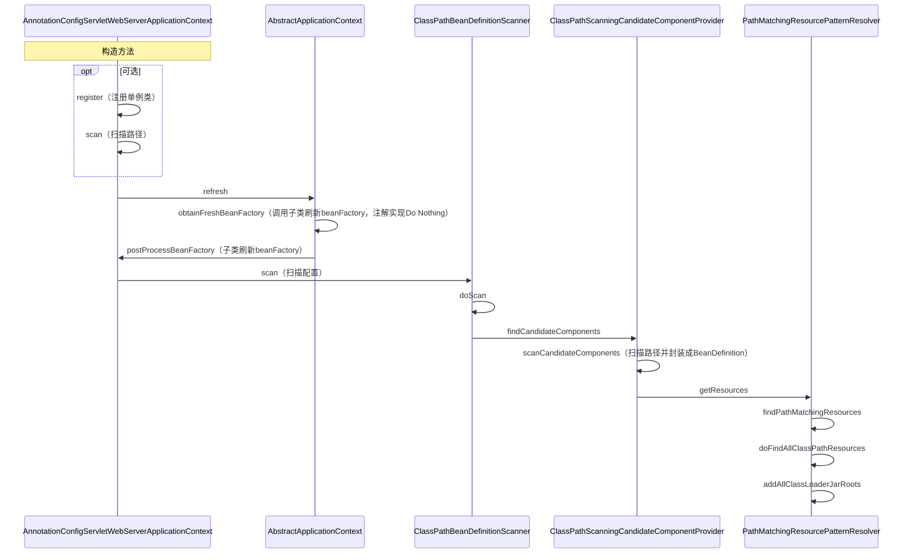

## DI时序图

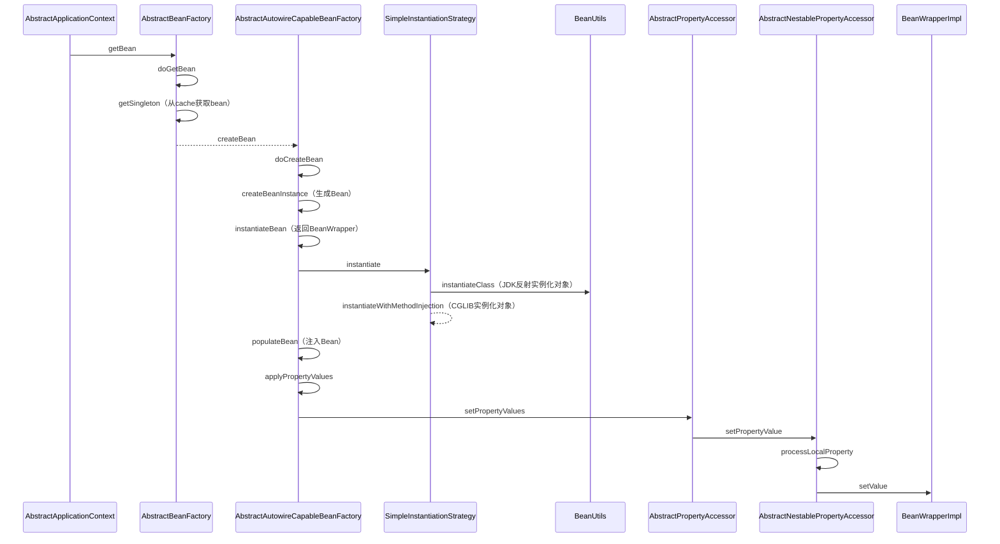

## AOP时序图

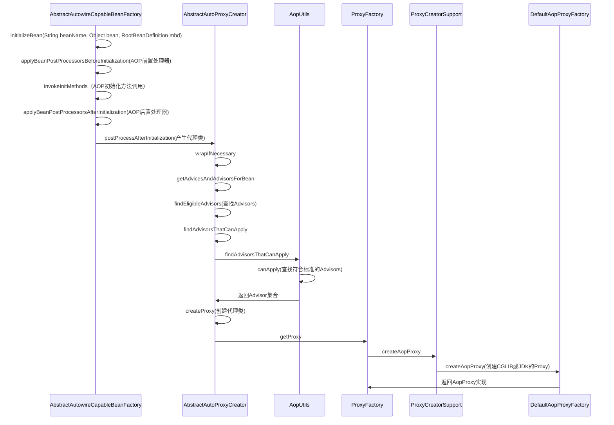

## 代理调用时序图

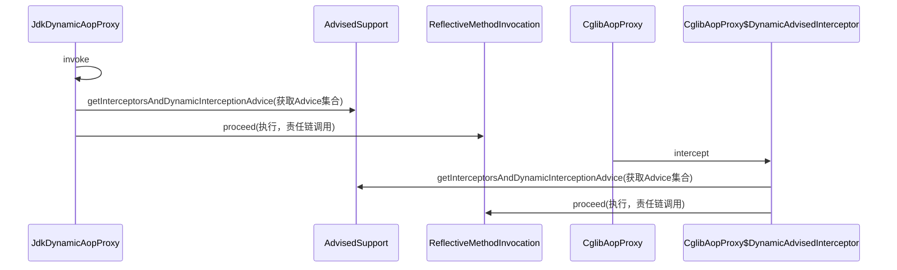

## MVC时序图

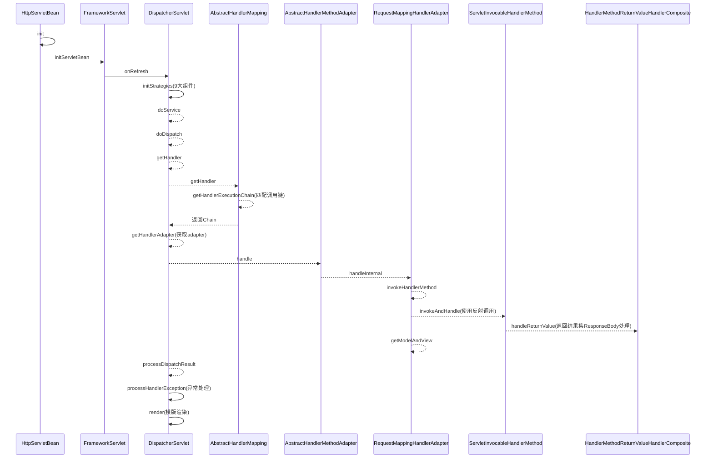

## 面试题

**1、使用Spring框架能给我们带来哪些好处？**

* 简化开发
  * 提供许多内置的解决方案（BOP（面向Bean编程），IoC，AOP）
  * 声明式事物管理，使用`TransactionManager`
  * 围绕Spring生态提供许多工具类，比如`RestTemplate`，`JdbcTemplate`

**2、`BeanFactory`和`ApplicationContext`的区别？**

* `ApplicationContext`是`BeanFactory`的实现类

* `BeanFactory`是顶层设计接口。`ApplicationContext`是用户设计接口，使用了门面模式，实现了`BeanFactory`，`MessageSource`、`ApplicationEventPublisher`、`EnvironmentCapable`

**3、Spring的生命周期？**

* 单例：Spring容器启动时候加载，Spring容器销毁时销毁，如果是延时加载，在调用前创建

* 原型：在调用前创建，调用后销毁

**4、Spring中用到哪些设计模式？**

工厂模式、单例模式（容器式单例）、原型模式（容器式多例）、代理模式、迭代器模式、享元模式（各种Cache）、门面模式（`ApplicationContext`）、委派模式、解释器模式（spring的`Expression`包）、建造者模式、责任链模式（`Filter`）、观察者模式（发布订阅模式）、适配器模式（`HandlerAdapter`） 、策略模式（`ContentNegotiationStrategy`解析MVC 中media type）、模板模式（各种钩子方法）

**5、Spring、Spring Boot、Spring Cloud区别？**

* Spring ：基础框架，包含日常开发所需的所有功能
* Spring Boot：
  * 约定优于配置，官方约定的一整套开发所需的配置，官方提供的脚手架，简化开发，开箱即用
  * 集成Web容器，直接jar包运行

* Spring Cloud：
  * 进军分布式生态：注册中心、服务发现、链路跟踪、配置中心、负载均衡、熔断策略等
* Spring Cloud 依赖Sping Boot 依赖Spring


# Mybatis

## 缓存

* 一级缓存
  * Session级别或statement
  * Executor从localCache获取写入数据
  * 建议statement级别，session在多个session情况下会出现脏数据
  * 默认开启
* 二级缓存
  * namespace级别
  * 使用CachingExecutor修饰Executor
  * 默认使用内存缓存，可以使用第三方缓存
  * 跨namespace可能出现脏数据
  * commit后才写入缓存

# 算法

## 全局唯一ID

### `UUID`

* `UUID.randomUUID().toString()`
* 缺点
  * 可能出现重复
  * 无有序的递增

### 数据库

* ```sql
  create table SEQUENCE(
  	SEQ_NAME VARCHAR2(1000),
  	SEQ_COUNT NUMBER(0)
  );
  ```

* 缺点

  * 受限数据库性能瓶颈

### 数据库集群

* 设置初始值和步长，解决单点故障问题

### 号段模式

* 从数据库批量获取id

### Redis

* incr

### 雪花算法

* 64为int
* 一位不用（为0，表示为正整数）+41位时间戳+10位机器码+12位序列号
* 缺点
  * 基于时间戳生成，产生时钟回拨问题
* 优化
  * 记录最后一次时间戳

### 叶子算法（Leaf）

* Leaf-segment

  * 数据库批量拿取号段
  * 缺点：
    * 号段用完去数据库取号段时受限网络
  * 优化：
    * 采用双Buffer，开启另外一个线程在一定条件下去取号段放到另一个Buffer中

  

# 分布式事务

## 协议

### XA-2PC

* 阶段
  * 准备命令
  * 提交/回滚
* 缺陷
  * 同步阻塞
    * 从第一阶段开始就拿到本地锁，参与者越多，阻塞越严重
  * 单点故障
    * TM是单点
  * 数据不一致
    * 发生网络问题，部分参与者没有收到提交消息

### 3PC

* 比2PC多了一个health阶段（CanCommit），提前校验节点是否正常，避免下阶段长时间持有锁
* 引入超时机制，参与者没有收到长时间没收到协调者请求，自动commit
* 缺陷
  * 数据不一致
    * 默认commit，如果TM发送的是abort

### TCC

* 2PC的业务层版本
* 注意事项
  * 允许空回滚
    * Try未执行，就执行cancel、此时cancel必须正常返回
  * 幂等
  * 资源悬挂
    * try未执行，cancel执行后，try再执行；使用状态机，cancel插入回滚状态

### AT

* 写过程
  * 一阶段：获取本地锁、执行sql、获取全局锁、提交、释放本地锁；拦截解析sql、生成"before image"、执行sql、生成"after image"
  * 二阶段：释放全局锁，异步删除undo log日志；获取本地锁，校验镜像数据，反向补偿更新
* 读过程
  * 默认读未提交
  * 使用SELECT FOR UPDATE实现读已提交，会申请全局锁
* 缺陷：
  * 第二阶段校验失败
    * 人工干预
    * 重试
  * 第二阶段ABA问题

### SAGA

* 实现方式
  * 状态机
  * 注解+拦截器

* 使用场景
  * 业务流程长、业务流程多
  * 参与者包含其它公司或遗留系统服务，无法提供 TCC 模式要求的三个接口
* 优势
  * 一阶段提交本地事务，无锁，高性能
  * 事件驱动架构，参与者可异步执行，高吞吐
  * 补偿服务易于实现
* 缺点
  * 不保证隔离性，出现脏写
    * 先扣款、再加款，后期人工干预
    * 允许最终一致性，重试

### BASE

* 基本可用、最终一致
* 异步消息

# 分布式一致性/共识算法

## 拜占庭将军问题

* 分布不通区域的将军们必须达到一致才能攻击敌军
* 将军可能是叛徒，信使可能是间谍
* 描述现实世界中，由于硬件错误、网络阻塞、恶意攻击；计算机和网络会出现不可预料的结果
* 解决方案
  * 中心化
  * 去中心化
    * 比特币区块链的工作量证明（CA认证机构也是类似）

## Paxos

* 法定人数：通常指多数派
* 过程
  * 第一阶段（可用于选举）
    * 准备：提议者发送一个提案编号N给法定人数
    * 许诺：接收者接受来自提议者的准备信息，如果大于之前接收的序号，则返回许诺（我一定选你），并把过去的许诺的提案编号和内容一起返回；否则忽略提案，或者回复拒绝
  * 第二阶段
    * 兑现：提议者发送提议编号N+提议内容（如果接收者有返回过去的内容，会修改为关联内容）
    * 接收：当接收者还没收到更大的许诺时，接受该提案；否则忽略
* 提议者提议失败，将使用更高的编号，轮次提议
* 活锁
  * 多个提议者交叉提议
  * raft设置随机时间
* Multi-Paxos
  * 删除第一阶段，选举一个leader

## ZAB协议

* Zab协议 的全称是 **Zookeeper Atomic Broadcast** （Zookeeper原子广播）
* zxid
  * 64位数字
  * 高32位代表了 Leader 周期的 epoch 编号，每次+1
  * 低32位代表计数器，每次+1

### ZAB状态

#### 崩溃恢复

* 当整个服务框架在启动中，或者当Leader服务器出现网络中断、崩溃退出与重启等异常情况时，zab协议就会进入崩溃恢复模式并选举出新的Leader服务器
* 崩溃恢复要求
  * **确保已经被 Leader 提交的 Proposal 必须最终被所有的 Follower 服务器提交**
  * **确保丢弃已经被 Leader 提出的但是没有被提交的 Proposal**
* Leader选举
  * 新选举的 Leader 必须都是已经提交了 Proposal 的 Follower 服务器节点
  * 新选举的 Leader 节点中含有最大的 zxid
* 数据恢复
  * **Leader未提交的数据同步**：B在成为Leader后，先判断自身未Commit的消息（本例中即P3）是否存在于大多数服务器中从而决定是否要将其Commit。然后B可得出自身所包含的被Commit过的消息中的最小zxid（记为**min_zxid**）与最大zxid（记为**max_zxid**）
  * **Follower同步**：最后的处理的zxid与L的min_zxid和max_zxid对比。
    * DIFF直接差异化同步：min_zxid<zxid<max_zxid
    * TRUNC仅回滚同步：zxid>max_zxid
    * SNAP全量同步：zxid<min_zxid
    * TRUNC+DIFF先回滚再差异化同步：原Leader提交后没有发给F就挂了，重启后须回滚该提交
  * **如何处理需要丢弃的 Proposal**：F的最后的提交请求与L对比，F执行回退操作

#### 原子广播

* Leader与每个F之间分配一个单独队列，根据FIFO发送消息

* Leader作为全局唯一服务器处理写请求，当提交数过半视为成功提交，并返回。

### CAP

#### 一致性

* **读一致性**：当Client向zookeeper发出读请求时，无论是Leader还是Follower，都直接返回查询结果，**所以读取到的数据可能是过期的旧数据，不是最新的数据**（因为只要半数成功就算写入成功）。如果客户端A和客户端B读取相同的值很重要，则客户端B应该在执行读取之前从ZooKeeper API方法调用sync()方法。
  * sync方法的解释：异步的实现当前进程与leader之间的指定path的数据同步
* **写一致性**：
  * 写入请求发送到Follower节点时，Follower节点将请求转发给Leader

#### 可用性

* 崩溃恢复状态时，服务不可用
* java GC的STW

### 持久化

* 事务日志
* 快照

## RAFT算法

* **Leader选举**
* 随机时钟，到时发起选举。
  * 日志组成：**任期号（term）**+**有序编号（log index）**+**状态机执行的命令**
  * **确保当选的leader包含所有日志**：在RequestVote中只会投给比大于等于自己最新日志的candidate
* **日志复制**

  * 流程
    * 客户端向leader发起，向follower发起的会转发给leader
    * leader 把这个指令作为一条新的日志条目**添加到日志**中，然后并行发起 RPC 给其他的服务器，让他们复制这条信息。
    * 假如这条日志被安全的复制，领导人就**异步应用这条日志到自己的状态机**中，并返回给客户端。
    * 如果 follower 宕机或者运行缓慢或者丢包，领导人会不断的重试，直到所有的 follower 最终都存储了所有的日志条目。
  * **当 leader 和 follower 日志冲突的时候**，leader 将**校验 follower 最后一条日志是否和 leader 匹配**，如果不匹配，**将递减查询，直到匹配，匹配后，删除冲突的日志**
* **日志压缩**
* 每1千次执行一次快照，删除wal
  * 做一次snapshot可能耗时过长，会影响正常日志同步。可以通过使用copy-on-write技术避免snapshot过程影响正常日志同步。
* 存放预写式日志
    * 所有数据修改前，都会写入wal中，使etcd拥有快速故障恢复和数据回滚
* 读写

  * 3.0：
    * 写操作成功仅仅以为着写操作被 commit 到日志上，并不能确保当前全局的状态机已经 apply 了该写日志。而状态机 apply 日志的过程相对于 commit 操作是异步的，因此在 commit 后立即读取状态机可能会读到过期数据。
    * 为了保证线性一致性读，早期的 etcd（**etcd v3.0** ）对所有的读写请求都会走一遍 Raft 协议来满足强一致性。然而通常在现实使用中，读请求占了 etcd 所有请求中的绝大部分，如果每次读请求都要走一遍 raft 协议落盘，etcd 性能将非常差。
  * 3.1：
    * **每次读操作时记录此时集群的 commit index，当状态机的 apply index 大于或者等于 commit index 时即可返回数据**
    * 集群的 commit index为**ReadIndex** 
      * 为了获取ReadIndex
        * **让 Leader 处理 ReadIndex 请求**
        * **广播一次，保证 Leader 仍然是目前的 Leader**
* Lease read
    * 比ReadIndex好的方案，但是由于时钟会出新双脑问题
    * 确认leader，通过续约保持，不用每次广播判断是否是leader
    * 依然通过commitindex

# 分布式锁

* **redis**

  * 单机：SET key value NX PX milliseconds。缺点：单点故障

  * Master-Slave：加锁的时候只对一个节点加锁，即便通过 Sentinel 做了高可用，但是如果 Master 节点故障了，发生主从切换，此时就会有可能出现锁丢失的问题。

  * Redis Cluster 模式：RedLock

    - 尝试在大多数节点上建立一个锁，比如 5 个节点就要求是 3 个节点（n / 2 +1）。

    * **缺点**：
      * 因为redis在进行主从复制时是异步完成的，比如在clientA获取锁后，主redis复制数据到从redis过程中崩溃了，导致没有复制到从redis中，然后从redis选举出一个升级为主redis,造成新的主redis没有clientA 设置的锁，这是clientB尝试获取锁，并且能够成功获取锁，导致互斥失效；
      * 时钟漂移相对TTL超时时间不可忽略的情况下。

* **zookeeper**
  
  * 在永久节点创建临时顺序节点，并watch上一个节点。如果序号最小则获取锁。释放时删除节点
  
* 续命锁

* 缓存数据库双写不一致

  * 分布式锁
  * redisson读写锁

# Java

## JDK

### HashMap

* 通过hashCode方法获取hash（`h ^ (h >>> 16)`高16位与低16位异或，`h & (length-1)` 取模），并通过equals判断是否相等

* 7
  * 头插
    * 并发下容易产生环
  * 数组+链表
* 8
  * 尾插
  * 数组+链表+红黑树
  * 到8转换成红黑树，减到6转回链表

### ThreadLocal

* `ThreadLocalMap`弱引用
* 
* 缺陷
  
  * 弱引用照成的内存泄漏
  * 代码改进：

    * `java.lang.ThreadLocal.ThreadLocalMap#replaceStaleEntry`
* 为什么使用弱引用
    * 当threadLocal置空时达到gc`ThreadLocal`的目的
* 使用开放寻址法
    * 删除时，先清除弱引用，再使用`expungeStaleEntry`扫描并清除null值的entry，非空的全部重hash

# JVM

## 组成

* 类加载器（ClassLoader）
* 运行时数据区（Runtime Data Area）
* 执行引擎（Execution Engine）
* 本地库接口（Native Interface）

## 对象布局

* 布局
  * MarkWord：包含一系列的标记位，比如轻量级锁的标记位、偏向锁标记位、gc记录信息等等。在32位系统占4字节，在64位系统中占8字节。
  * ClassPointer：用来指向对象对应的Class对象（其对应的元数据对象）的内存地址。在32位系统占4字节，在64位系统中占8字节。（ClassPointer类指针压缩默认开启，4字节）
  * Length（数组对象才有）：只在数组对象中存在，用来记录数组的长度，占用4字节。
  * instance object：oops普通对象指针压缩开启，超过32G关闭
  * Padding：对象补齐，8的倍数，64位cpu每次读取8字节；对齐防止跨区存储对象
* new Object多少字节
  * 未压缩：8+8=16
  * 压缩：8+4+padding=16
* new int[]多少字节
  * 未压缩：8+8+4+Padding=24
  * 压缩：8+4+4=16

## 类加载机制

* 过程
  * 加载
    * 从各个地方加载
  * 验证
    * 确保Class文件字节流符合虚拟机要求并且不危害虚拟机安全
  * 准备
    * 正式为类变量分配内存并设置类变量的初始值阶段，即在方法区中分配这些变量所使用的内存空间。
    * public static int v = 8080; //v=0
    * public static final int v = 8080;//在编译阶段会为 v 生成 ConstantValue 属性，在准备阶段虚拟机会根据 ConstantValue 属性将 v赋值为 8080。
  * 解析
    * 虚拟机将常量池中的符号引用替换为直接引用的过程。
    * 符号引用：像CONSTANT_Class_info这种class文件格式
    * 直接引用：指向目标的指针（直接指针或使用句柄）
  * 初始化
    * 执行类构造器初始化方法（编译器自动收集类中的所有类变量的赋值动作和静态语句块static{}中的语句）
    * 以下几种情况不会执行类初始化：
      * 通过子类引用父类的静态字段，只会触发父类的初始化，而不会触发子类的初始化。
      * 定义该类数组，不会触发该类的初始化。
      * 常量在编译期间会存入调用类的常量池中，本质上并没有直接引用定义常量的类，不会触发定义常量所在的类。
      * 通过类名获取 Class 对象，不会触发类的初始化。
      * 通过 Class.forName 加载指定类时，如果指定参数 initialize 为 false 时，也不会触发类初始化，其实这个参数是告诉虚拟机，是否要对类进行初始化。

## Class卸载

- classloader被GC
- 所有类实例被GC
- Class没有在任何地方引用，如不能通过反射访问该类

## 内存模型

* 程序计数器
  * 线程私有
  * 不会发生OOM
* 方法栈
  * 线程私有
  * 异常
    * StackOverflowError
    * OOM
  * 结构
    * 本地变量表
    * 操作数栈
    * 运行常量池引用
    * 动态链接
      * 动态调用方法，把符号引用变成直接引用
* 本地方法栈
  * 和方法栈类似
* 方法区
  * 线程共享
  * 存储被 JVM 加载的类信息**、**常量**、**静态变量、即时编译器编译后的代码
  * 运行时常量池
  * OOM
* 堆
  * 线程共享
  * OOM

## 回收算法

* 查找垃圾
  * **HotSpot使用采用直接指针对对象进行访问，（还有一种使用句柄，相当于两层指针）**
  * 引用计数法
  * 可达性分析，GC root
    * 方法区静态变量和常量
    
    * 方法栈本地变量表引用对象
    * 本地方法栈引用对象
* 复制算法
* 标记-清除算法 （空闲列表）
* 标记-整理算法（指针碰撞）
  * 整理
    * 双指针算法（随意顺序）：tag从尾查找可达对象，移到head，两指针碰撞结束
      * 缺陷：只适合处理固定大小对象
    * 滑动顺序
* 分代收集算法
* 引用类型
  * 强引用
  * 软引用
    * 适合做缓存
  * 弱引用
* 虚引用
* FullGC触发条件

  * system.gc
  * 并发模式失败
      * 并发阶段，老年代填满
  * 晋升失败
    * 老年代无法容纳新生代晋升的所有对象
  * 疏散失败
    * 新生代搜集，Survivor空间和老年代没有足够空间容纳所有对象
  * 巨型对象分配失败
  * 元空间不足

## 垃圾收集器

* Serial 单线程 
* parnew 多线程 
* Parallel Scavenge 吞吐量（老年代标记整理）
* YGC
  * 老年代指向新生代
    * 新生代晋升，gc线程本身记录
    * 修改引用关系，使用卡表
  * 卡表
    * point-out
    * 在CMS中，记录从老年代到新生代的引用，通过写后屏障更新
    * 实际实现发生引用赋值就标记为1
    * 字节数组，每512字节划分一个card，有引用标1，没有标0
* CMS（老年代标记清除）
  * 适合小型堆
  * 两种模式
    * background 
      * 周期full gc，默认每两秒扫描一次是否达到阈值（0-100默认-1，不生效；通过参数计算）
      * 7初始标记串行，8默认开启并发
    * foreground
      * 主动FULL gc
      * 设置多少次full gc进行压缩（默认每次），进行一段时间后切换serial old进行标记整理
      * 老年代并发模式失败（切换单线程收集器，听R大说偷懒了）
      * YGC晋升失败
  * 卡表与增量更新
    * 写屏障只记录卡表
    * CMS再检测到YGC时，更新维护一张union表
  * 过程
    * 初始标记
      * 遍历root，标记老年代
      * 遍历新生代，标记老年代
    * 并发标记
      * 从上一步的开始扫描，维护增量更新
    * 预处理
      * 属于并发标记一部分
      * 提前做重新标记的事情
    * **可中断的预处理**
      * 扫描处理新生代到老年代的引用，并期望获得一次YGC或者等5秒
      * eden大于2M开启
      * eden使用率超过50%推出
    * 重新标记（瓶颈点）
      * STW
      * 扫描处理Dirty Card
    * 并发清除
  * 缺陷
    * 标记清除产生过多内碎片
      * 可以晚上定时GC并整理
* G1
  * 每个区1-32M
  * 2048个区
  * 适合大型堆
  * 分区垃圾回收算法
  * GC 种类
    * YGC
      * STW
      * 选择出所有新生代的region，进行root扫描
      * 更新rset引用变化
      * 复制
      * 重构rset
      * 释放空间
      * 动态扩展内存和region数量
      * 是否进行并发标记
    * Major GC
      * YGC后预估时间还够 
      * 回收一定old区
    * FULL GC
      * 内存不足时，串行收集；10后可以并行
    * 都会GC Y区，所以记忆集不需要记录新生代指向老年代引用
  * 记忆集

    * 记忆集就是用来记录跨代引用的表，通过引入记忆集避免遍历老年代。以YGC为例说明，要回收年轻代，只需要引用年轻代对象的GC ROOT+记忆集，就可以判断出Young区对象是否存活，不必再遍历老年代。
    * point-in
    * 结构  
      * 哈希表：key为region起始地址，value为数组，记录卡表的索引
      * 细粒度的位图
      * 粗粒度位图，算力足够，卡表过多
    * 比如A对象在regionA，B对象在regionB，且B.f = A，则在regionA的RSet中需要记录一对键值对，key是regionB的起始地址，Value的值能映射到B所在的Card的地址，所以要查找B对象，就可以通过RSet中记录的卡片来查找该对象
    * 缺点：浪费一定的空间；
      滞后性->由于跨代引用的对象源没有被回收，跨代引用的目标对象也不会被回收
  * 分区类别
    * eden
    * survivor
    * old
    * h大对象
  * 三色标记法
    * 黑色:根对象，或者该对象与它的子对象都被扫描
    * 灰色:对象本身被扫描,但还没扫描完该对象中的子对象
    * 白色:未被扫描对象，扫描完成所有对象之后，最终为白色的为不可达对象，即垃圾对象。
  * 对象引用

    * 第一步: var G = objE.fieldG; //读
    * 第二步: objE.fieldG = null; // 写
    * 第三步: objD.fieldG = G; // 写
  * 漏标原因

    * 一、灰色删除了白色引用
    * 二、黑色添加了白色引用
  * 三色不变式
    * 强三色不变式
      * 不存在黑色对象引用到白色对象的指针
    * 弱三色不变式
      * 所有被黑色对象引用的白色对象都处于灰色保护状态
  * 漏标方案

    * G1：第二步引用发生变化时，记录原来的成员变量G，标灰
      * 写屏障+STAB，将旧的引用记录下来
    * CMS：第三步，新增引用时，标灰
      * 写屏障+增量更新，将新的引用记录下来
    * ZGC：第一步，读取引用时，标灰
    * go1.5：
      * 插入屏障（CMS）：
        * 灰色复制器
        * 强三色不变式
        * 引用对象时，强制标灰
        * 缺点：
          * 被标记为灰色的对象如果与黑色断掉引用关系依然会存活，产生垃圾对象
          * 关闭栈上的写屏障，需要终止阶段STW并对栈重新扫描
      * 删除屏障（G1），go没用。。。:
        * 黑色赋值器
        * 弱三色不变式
        * 删除引用时，下游标灰
        * 缺点：需要STW记录初始快照（STAB）保护开始的存活对象，浮动垃圾
    * go1.8:
      * 混合屏障
        * 黑色赋值器，栈标黑，新建栈对象标黑
        * 删除标灰，新建标灰
      * 因为双倍标记性能，添加批量写屏障缓存，缓存满时统一着色
  * SATB的全称（Snapshot At The Beginning）在初始标记开始时，G1 收集器打了一个快照，形成一个所谓的对象图，记录删除屏障的旧数据


## 命令

* jps 查看进程号
* jinfo 查看运行参数
* jstat 定时打印类加载信息，gc信息
* jstack 查看线程信息，比如检查死锁
* jmap 查看堆信息
* jcmd 查看堆直方图、堆转储、启动参数、环境参数，jmap替换

## JIT编译器（即时编译器）

* 热点编译
  * HotSpot代码编译方式
  * 类型
    * C1编译器（client 编译器）
      * 开启编译比c2快
      * 执行时间短，如客户端程序
    * C2编译器（server 编译器）
    * 分层编译：综合C1的启动优势和C2的长期性能优势
  * 分层级别
    * 0 解释代码
    * 1 简单的c1
      * profile性能监控
    * 2 受限的c1
      * 搜集profile中方法和回边的数据
    * 3 完全的c1
      * 搜集全部profile
    * 4 c2
  * 基于采样的热点探测
    * 采取方法栈顶端的方法
    * 缺点：如果阻塞方法
  * 基于计数器的热点探测
    * 方法调用计数器
    * 回边计数器
      * 每循环一次增加一次
      * 栈上替换（OSR）
        * 到达阀值时直接编译循环并替换栈上的代码
    * 每个计数器都会随时间减半（特别是到达安全点时）
  * 优化技术
    * 方法内联
      * 由于方法调用前需要保存现场，调用后需要恢复现场，所以优化后把代码复制到发起调用的方法中，避免真正的调用
    * 逃逸分析
      * 栈上分配
      * 锁消除
      * 标量替换
        * 如果一个对象可以拆分，就创建成员变量替换
  * 代码缓存（-XX:ReservedCodeCacheSize）
    * 编译代码时，缓存编译后的汇编指令集
  * 逆优化
    * 代码被丢弃
      * 比如if else，通过参数访问if，热编译if里面的内容，之后访问else，那么if代码将被编译将被终止，从而编译else的
    * 僵尸代码
      * 上面的if代码产生的对象被回收后，编译器会注意到这部分适合标记为僵尸代码，将会被移除

## 性能优化

* TLAB
  * 减少线程在堆的对象分配竞争；根据线程历史信息，动态确定分配大小，用完再分配；浪费的空间生成填充对象补齐
* PLAB
  * 用于新生代晋升老年代的对象分配竞争
* 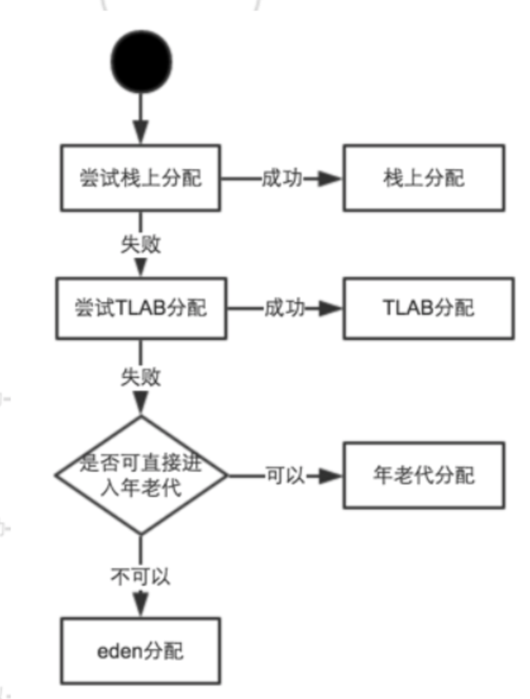


## GC调优

* 需平衡分代大小，垃圾回收次数和STW时间
* 监控各年代占用大小，Y F GC触发频率，对象分配速度等

# IO

* IO模型
  * 阻塞IO模型
    * 基于Stream
  * 非阻塞IO模型
    * 当用户线程发起一个 read 操作后，并不需要等待，而是马上就得到了一个结果。
    * 用户线程需要不断地询问内核数据是否就绪，也就说非阻塞 IO不会交出 CPU，而会一直占用 CPU。
    * 在 while 循环中需要不断地去询问内核数据是否就绪，这样会导致 CPU 占用率非常高，因此一般情况下很少使用 while 循环这种方式来读取数据。
  * 多路复用IO模型
    * 基于Buffer
    * 与非阻塞IO区别
      * 非阻塞IO通过用户线程询问socket
      * 多路复用IO通过内核线程询问socket
    * Reactor模式
      * 单线程
      * 多线程
  * 信号驱动IO模型
    * 在信号驱动 IO 模型中，当用户线程发起一个 IO 请求操作，会给对应的 socket 注册一个信号函数，然后用户线程会继续执行，当内核数据就绪时会发送一个信号给用户线程，用户线程接收到信号之后，便在信号函数中调用 IO 读写操作来进行实际的 IO 请求操作。
  * 异步IO模型
    * Proactor模式
      * 与 Reactor 模式不同，Proactor 模式将所有 I/O 操作都交给主线程和内核来处理**， **工作线程仅仅负责业务逻辑。

# 集合

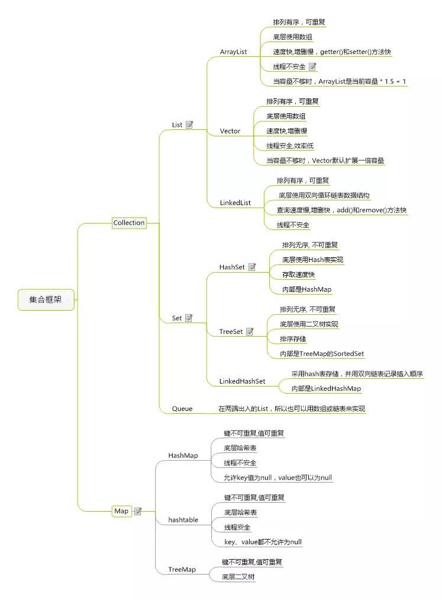

* Collection
  * Vector
    * 使用synchronized实现线程安全
* Map
  * ConcurrentHashMap
    * synchronized锁细化，采用cas

# 多线程

## 线程与线程池

* ThreadPoolExecutor
  * 参数：核心线程数、最大线程数、存活时间、时间单位、阻塞队列、线程工厂、拒绝策略
  * 拒绝策略
    * **AbortPolicy:丢弃任务并抛出RejectedExecutionException异常**
    * **DiscardPolicy：也是丢弃任务，但是不抛出异常**
    * **DiscardOldestPolicy：丢弃队列最前面的任务，执行后面的任务**
    * **CallerRunsPolicy：由调用线程处理该任务**

* Thread.sleep()会让出时间片
* Thread.yield()和Thread.sleep(0)
  * java语言规范不希望yiled和spleep(0)具有很强的明确语义，可以不用实现他们。
  * hotspot两个意义都是让出剩下的时间片，进入队列末尾

## 锁

* 死锁的四个必要条件

  * 互斥条件

  * 不可剥夺条件

  * 请求与保持条件

  * 循环等待条件

* synchronized

  * 独占锁

  * 可重入

  * 非公平锁

    * Synchronized 在线程进入 ContentionList 时，等待的线程会先尝试自旋获取锁，如果获取不到就进入 ContentionList，这明显对于已经进入队列的线程是不公平的，还有一个不公平的事情就是自旋获取锁的线程还可能直接抢占 OnDeck 线程的锁

      资源。

  * 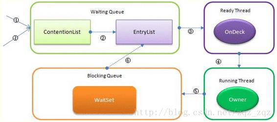
  * 每个对象都有个 monitor 对象，加锁就是在竞争 monitor 对象，代码块加锁是在前后分别加上 monitorenter 和 monitorexit 指令来实现的，方法加锁是通过一个标记位来判断的

* synchronized与ReentrantLock
  *  底层实现
    * synchronized是JVM层面的锁，属于关键字，通过monitor对象完成锁；ReentrantLock是api层面的锁
    * synchronized 的实现涉及到锁的升级，具体为无锁、偏向锁、自旋锁、向OS申请重量级锁；ReentrantLock实现则是通过利用CAS（CompareAndSwap）自旋机制保证线程操作的原子性和volatile保证数据可见性以实现锁的功能，LockSupport提供挂起/恢复线程的能力
    * synchronized 不需要用户去手动释放锁；ReentrantLock需要手动释放
    * synchronized是不可中断类型的锁；ReentrantLock则可以中断，可通过trylock(long timeout,TimeUnit unit)设置超时方法或者将lockInterruptibly()放到代码块中，调用interrupt方法进行中断
    * synchronized为非公平锁；ReentrantLock则即可以选公平锁也可以选非公平锁
    * synchronized只能随机唤醒或全部唤醒；ReentrantLock可以根据Condition精确唤醒
    * synchronzied锁的是对象；ReentrantLock使用aqs的state标识锁
  
* ### wait、notify、park、unpark

  *  wait和notify方法必须和同步锁 synchronized一块儿使用。而park/unpark使用就比较灵活了，没有这个限制，可以在任何地方使用。
  * park/unpark 使用时没有先后顺序，都可以使线程不阻塞（前面代码已验证）。而wait必须在notify前先使用，如果先notify，再wait，则线程会一直等待。
  * notify只能随机释放一个线程，并不能指定某个特定线程，notifyAll是释放锁对象中的所有线程。而unpark方法可以唤醒指定的线程。
  * 调用wait方法会使当前线程释放锁资源，但使用的前提是必须已经获得了锁。而park不会释放锁资源。

* 锁优化
  * 减少锁持有时间
  * 减小锁粒度
  * 锁分离（读写锁）
  * 锁粗化
  * 锁消除
  
* volatile

  * 变量可见性（跳过cpu缓存，直接读取内存）、禁止重排序

## 工具类

* Semaphore与ReentrantLock
  * Semaphore的acquire和release没有顺序关系，可以一直释放许可；ReentrantLock只有一个许可
  * Semaphore允许多个线程共享资源；ReentrantLock只允许一个
* CountDownLatch和CyclicBarrier
  * 都能够实现线程之间的等待
  * CountDownLatch一般用于某个线程A等待若干个其他线程执行完任务之后，它才执行；而CyclicBarrier一般用于一组线程互相等待至某个状态，然后这一组线程再同时执行；
  * 另外，CountDownLatch是不能够重用的，而CyclicBarrier是可以重用的（reset方法）。
* Atomic
  * ABA问题
    * `AtomicStampedReference`添加标记
* ReadWriteLock读写锁
  * AQS 的内部类 Node 定义了两个常量 SHARED 和 EXCLUSIVE，他们分别标识 AQS 队列中等待线程的锁获取模式。
* AQS
  * 双向链表 + state(锁状态)
  * 底层操作：CAS+LockSupport（park，unpark）

# Netty

## 零拷贝

* Netty 的接收和发送 ByteBuffer 采用 DIRECT BUFFERS，使用堆外直接内存进行 Socket 读写，不需要进行字节缓冲区的二次拷贝。如果使用传统的堆内存（HEAP BUFFERS）进行 Socket 读写，JVM 会将堆内存 Buffer 拷贝一份到直接内存中，然后才写入 Socket 中。相比于堆外直接内存，消息在发送过程中多了一次缓冲区的内存拷贝。
* Netty 提供了组合 Buffer 对象，可以聚合多个 ByteBuffer 对象，用户可以像操作一个 Buffer 那样方便的对组合 Buffer 进行操作，避免了传统通过内存拷贝的方式将几个小 Buffer 合并成一个大的Buffer。
* Netty的文件传输采用了transferTo方法，它可以直接将文件缓冲区的数据发送到目标Channel，避免了传统通过循环 write 方式导致的内存拷贝问题

## Q

* 如何解决空轮询bug？
  * 对 Selector 的 select 操作周期进行统计，每完成一次空的 select 操作进行一次计数，若在某个周期内连续发生 N 次空轮询，则触发了 epoll 死循环 bug。重建Selector，判断是否是其他线程发起的重建请求，若不是则将原 SocketChannel 从旧的Selector 上去除注册，重新注册到新的 Selector 上，并将原来的 Selector 关闭。
* TCP粘包/拆包原因和解决办法？
  * 原因
    * 应用程序写入的字节大小大于套接字发送缓冲区的大小，会发生拆包现象，而应用程序写入数据小于套接字缓冲区大小，网卡将应用多次写入的数据发送到网络上，这将会发生粘包现象；
    * 进行 MSS 大小的 TCP 分段，当 TCP 报文长度-TCP 头部长度>MSS 的时候将发生拆包以太网帧的 payload（净荷）大于 MTU（1500 字节）进行 ip 分片。
  * 解决方案
    * 消息定长：FixedLengthFrameDecoder 类
    * 包尾增加特殊字符分割：行分隔符类：LineBasedFrameDecoder 或自定义分隔符类：DelimiterBasedFrameDecoder
    * 将消息分为消息头和消息体：LengthFieldBasedFrameDecoder 类。分为有头部的拆包与粘包、长度字段在前且有头部的拆包与粘包、多扩展头部的拆包与粘包。

# 网络

## tcp

* 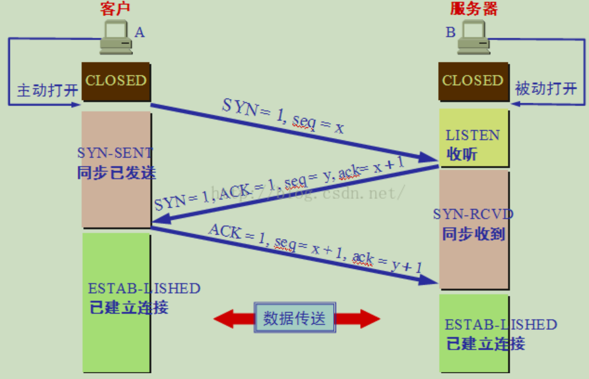
  * 为什么不能用两次握手进行连接
    * 客户端发送1到服务器，未得到回复，发送2到服务器，此时1延迟到达服务器。如果两次握手1也会正式连接，浪费服务器资源
* 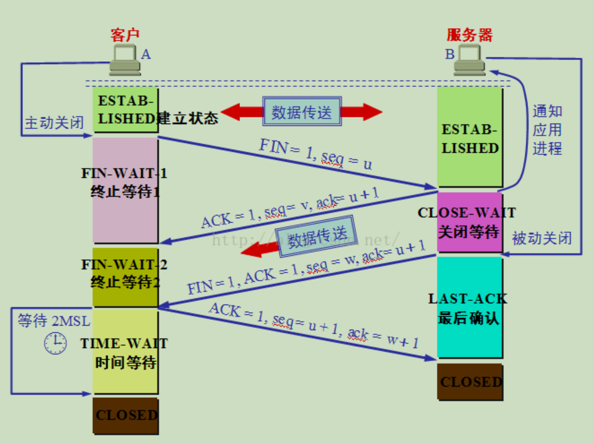
  * 为什么TIME_WAIT状态还需要等2MSL后才能返回到CLOSED状态
    * 因为我们必须要假想网络是不可靠的，你无法保证你最后发送的ACK报文会一定被对方收到，因此对方处于LAST_ACK状态下的SOCKET可能会因为超时未收到ACK报文，而重发FIN报文，所以这个TIME_WAIT状态的作用就是用来重发可能丢失的ACK报文。
    * 允许老的重复的分节在网络中消逝，防止延迟请求建立新连接
  * 先关读通道，后关写通道

* status

  * 301 Moved Permanently(永久移动)

    302 Found(临时移动)

    303 See Other(查看其他位置)

    304 Not Modified(未修改)

    305 Use Proxy(使用代理)

    306 *unused*(未使用)

    307 Temporary Redirect(临时重定向)

    308 Permanent Redirect(永久重定向)

    * 302(post、get->get)=303(post、get->get)=307(post->post, get->get)
    * 301(post、get->get)=308(post->post, get->get)

  * 400 Bad Request(错误请求)

    401 Unauthorized(未授权)

    402 Payment Required(需要付款)

    403 Forbidden(禁止访问)

    404 Not Found(未找到)

    405 Method Not Allowed(不允许使用该方法)

    406 Not Acceptable(无法接受)

  * 500 Internal Server Error(内部服务器错误)

    501 Implemented(未实现)

    502 Bad Gateway(网关错误)

    503 Service Unavailable(服务不可用)

    504 Gateway Timeout (网关超时)

    505 HTTP Version Not Supported(HTTP 版本不受支持)

## SSL

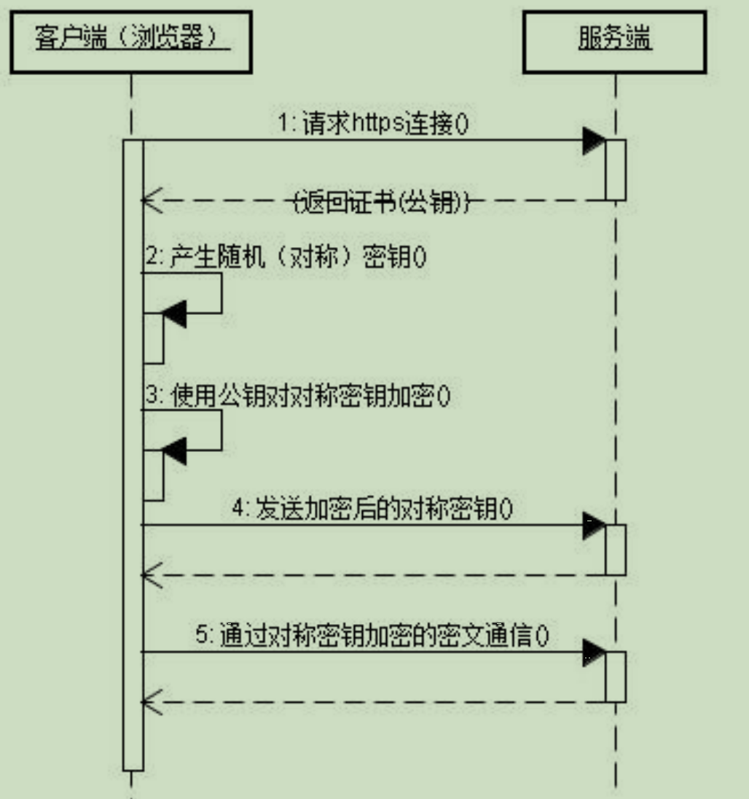

# RabbitMQ

* Exchange 类型
  * direct
    * 单播，完全匹配
  * fanout
    * 广播，发放所有绑定的队列
  * topic
    * 主题，规则匹配
  * headers
    * 匹配消息的header，基本和direct一致，性能较差
* 集群
  * 镜像队列模式
    * 节点通过mirror队列进行同步
    * HAProxy高可用+Keepalived组件提供虚拟ip
* 死信队列
  * 进入死信队列原因：
    * 消息被否定确认
    * 存活时间超过TTL
    * 消息数量超过队列最大长度

* 确保消息不丢失
  * 生产者消息
    * 1、开启MQ事务
      * 缺点：事务阻塞
    * 2、confirm机制
      * 异步确认
  * MQ消息
    * 1、持久化
      * 交换机持久化
      * 队列持久化
      * 消息持久化发送
    * 2、设置集HA群镜像模式
    * 消息补偿机制
      * 持久化后磁盘坏了。。
      * 写DB日志，补偿服务
  * 消费者
    * ACK确认机制

* 不重复消费
  * id幂等

# Redis

## 数据结构

### String

* 类型
  * int：只对长度小于或等于 21 字节，并且可以被解释为整数的字符串进行编码
    * redis启动时创建0~9999的redisObject作为共享变量
  * embstr：尝试将 RAW 编码的字符串编码为 EMBSTR 编码
    * 存储字符串长度小于44的字符串（REDIS_ENCODING_EMBSTR_SIZE_LIMIT）（16+1+3（sdshdr8头））
    * jemalloc可以分配8、16、32、64等字节内存
    * embstr为只读，修改时转为raw
    * 创建一个内存空间，内存连续
* raw：这个对象没办法进行编码，尝试从 SDS 中移除所有空余空间
    * 创建两个内存空间，`redisObject` 和 `sdshdr`，内存不连续
  
* SDS（simple dynamic string）

  * ```c
    struct sdshdr8 {
        // 记录 buf 数组中已使用字节的数量
        // 等于 SDS 所保存字符串的长度
        uint8_t len;
        // 记录 buf 数组中未使用字节的数量
        uint8_t alloc;
        // 记录sds是哪种类型
        unsigned char flags;
        // 字节数组，用于保存字符串
        char buf[];
    };
    ```
  
* 优化策略
  
    *  空间预分配
       *  小于1M，len=free
        *  大于1M，free=1M
    *  惰性空间释放
       *  删除不会释放空间，而是添加到free
       *  如果有必要，使用API释放SDS未使用空间
       
    * SDS和C字符串的区别
    
    * C获取子串长度O(N)；SDS本身有len属性O(1)
    * C字符串拼接时不重新分配扩展数组空间大小，造成内存溢出、截断时不释放空间造成内存泄漏；SDS使用空间预分配和惰性空间释放两种分配策略
    * SDS保留末尾'\0'，可以重用C语言部分函数

### List

* 压缩列表
* 链表
  * 双端
  * 无环
  * 带头尾指针
  * len

### HashMap

* 压缩列表

* 字典

  * ```c
    // 哈希表
    typedef struct dictht {
        // 哈希表数组
        dictEntry **table;
        // 哈希表大小
        unsigned long size;
        // 哈希表大小掩码，用于计算索引值
        // 总是等于 size - 1
        unsigned long sizemask;
        // 该哈希表已有节点的数量
        unsigned long used;
    } dictht;
    // 哈希节点
    typedef struct dictEntry {
        // 键
        void *key;
        // 值
        union {
            void *val;
            uint64_t u64;
            int64_t s64;
        } v;
        // 指向下个哈希表节点，形成链表
        struct dictEntry *next;
    } dictEntry;
    // 字典
    typedef struct dict {
        // 类型特定函数
        dictType *type;
        // 私有数据
        void *privdata;
        // 哈希表，第二个哈希表用于rehash 
        dictht ht[2];
        // rehash 索引
        // 当 rehash 不在进行时，值为 -1
        int rehashidx; /* rehashing not in progress if rehashidx == -1 */
    } dict;
    ```


* 哈希冲突
  
  * 链式寻址法
    * 头插
    * 渐进式rehash，把一次rehash分摊到每次增删改，根据rehashidx逐渐迁移，直至-1

### Zset

* 压缩列表

* 跳跃表
  * vs红黑树
  * 实现简单
* 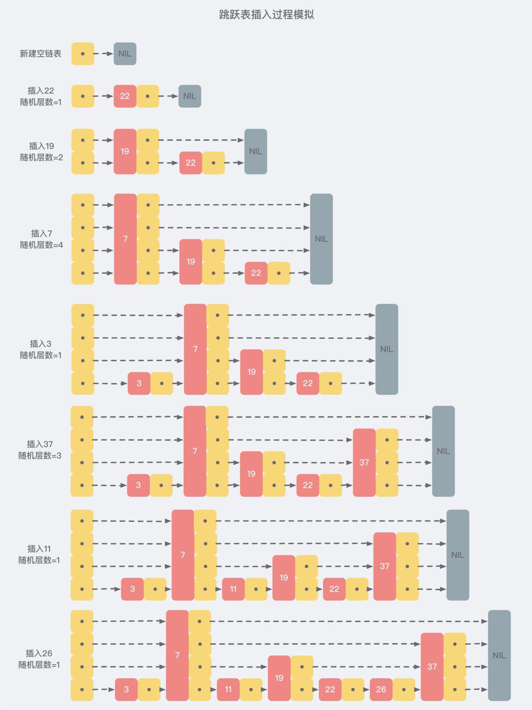

### Set

* 整数集合
* 字典


## 故障方案

* 缓存雪崩
  * 大量key同时过期
  * TTL+随机值
* 缓存穿透
  * 某个key不存在
  * 布隆过滤器
  * 空值写入缓存
* 缓存击穿
  * 一个key过期后，大量请求
  * 热点定时更新
  * 设置永不过期
  * 使用分布式锁
  * 做好熔断，服务降级

## 持久化

* RDB
  * 触发
    * 自动触发
    * 配置文件save 。。。
    * 手动触发
    * save 。。。
  * 优点
    * 只有一个.rdb文件，方便持久化
    * fork一个子进程完成持久化，不影响主进程使用
  * 缺点
    * 定时持久化，宕机部分丢失
* AOF
  * 优点
    * 可以选择频率写aof文件
      * always，每次写入缓存就调用系统同步操作，成功才返回；io会成为瓶颈
      * no，每次写入缓存就换回，操作系统默认30秒同步一次
      * everysec，每次写入就返回，由专门线程没秒同步
    * 内容比rdb大
  * 缺点
    * 文件比rdb大
* 选择
  * 最好同时使用两种持久化策略，重启时优先读取AOF文件。RDB文件非常利于备份，比AOF恢复快。

## 过期策略

* 定时删除：对内存友好，但会大量占用cpu资源
* 惰性删除：访问时判断，大量节约cpu资源，对内存不友好
* 定期删除：则中方案，定时扫描expires（有过期的key索引）字典数据，删除过期数据，通过调整扫描时间和每次扫描耗时达到平衡

## 淘汰策略

* 所有算法都是抽样
* volatile-lru
  * 从已设置过期时间中删除最近最少使用
  * 适合冷热数据分别，并设置了过期时间
* volatile-ttl
  * 从已设置过期时间中删除快过期的
* volatile-random
  * 从已过期中随机删除
* allkeys-lru
  * 从所有集合中删除最近最少使用
  * ttl会占用额外内存，如果都没有过期时间使用该策略可以更高效利用内存
* allkeys-random
  * 从所有集合中随机删除
* noeviction
  * 报错

## 高可用

* 主从复制
  * 主节点和从节点通过数据流进行同步
  * 重连时，从节点从主节点获取连接期间丢失的数据流进行部分同步
  * 如果同步失败，会尝试全量同步，主节点需要创建一份快照，发送给从节点

* 哨兵模式
  * 监控
    * 不停监控主从节点是否正常
  * 提醒
    * 当某个节点故障时，可以通过api发送提醒
  * 自动故障转移
    * 当主节点故障时，会从下面的从节点升级为主节点，并让其他节点复制新的主节点的数据
    * 当客户端连接失败时，会发送新的主节点地址给客户端
* 多主集群
  * 采用哈希槽分配数据（CRC16（key的值）%16384）
* 数据丢失
  * 可以配置最小从节点和最大同步时间，当不满足条件时主节点不会接受任何请求，减少数据丢失

# MYSQL

## MYSQL布局

* 磁盘读取每页16K
* buffer pool：内存缓冲池
  * 相当于内存mysql，数值越大，性能越好
  * LRU算法淘汰冷数据（使用map+双向链表，双向链表分冷热区域，新数据进冷区域，访问数据放到头部）
* redo log buffer：
  * type 0：每秒刷redo log
  * type 1默认：每次事务
  * type 2：每次事务刷到操作系统内存，每秒刷redo
* redo log：日志文件（顺序写）
  * 大小固定
  * 写满触发写DB file，以腾出空间
* DB file：日志持久化文件
* undo log：记录事务前数据，用于回滚
* 事务更新过程：
  * 从buffer pool或DB file读取数据到server
  * 修改数据a=1->a=2
  * 记录undo日志a=1
  * 记录redo日志a=2
  * 记录数据到buffer pool
* binlog：
  * 以逻辑日志记录所有DDL、DML，用于做数据恢复
    * 需要定时备份全量日志，根据全量日志恢复，再加上binlog的日志
* 双写缓冲
  * 刷入磁盘前，先备份磁盘数据，如果刷入过程中故障，使用备份恢复

## 索引

* 主键索引
  * 如果存在主键
  * 如果不存在主键，有不包含NULL的唯一索引
  * 如果都没有，创建隐藏列
* 为何不能多建索引
  * 索引需要占用大量的磁盘空间
  * 每次修改数据都需要更新索引
* 索引建立原则
  * 离散程度高
  * 联合索引最左匹配
  * 用于where判断，order排序，join，group by的字段
  * 索引不能太多
  * 不能频繁更新
  * 无序值最好不作索引
  * 字段过长可以建立前缀索引，节省存储
* 索引优化
  * 覆盖索引
    * 如果索引包含全部查询字段，就不需要回表（查主键索引）
    * explain的extra为Using Index
  * 索引条件下推ICP（默认）
    * 比如查询联合索引，第二个字段使用like左边%
      * 没有ICP，普通索引查询第一个字段后，回表查询主键索引，返回给Server，Server再执行like过滤
      * 使用ICP，直接在存储引擎执行like，返回给Server过滤后数据
    * explain的extra为index condition pushing down

## 事务与锁

* 四大特性

  * 原子性

    * 事务回滚undo log

  * 隔离性

    * 锁
    * mvcc

  * 持久性

    * redo

    * 双写缓冲

  * 一致性

* 锁

  * 当前读
  * 读锁 lock in share mode
  * 写锁 for update
  * 行锁
    * 记录锁：一条一条数据
      * where条件精准命中
    * 间隙：数据间没有数据的空隙
      * 插入加锁，不影响查询
      * 只有可重复读级别
    * 邻键：一条记录加下一个间隙
      * 和间隙相似

* MVCC

  * 快照读
  * 其他事务插入删除修改，不影响本事务
  * 事务开启时创建一致性视图
    * 未提交的活跃事务id（用于判断，不读取未提交的数据）
    * 当前事务id的下一个id（用于判断，不读取大于当前的数据）
    * 判断
      * 从undo log中查找数据链

## 优化

* 连接
  * 增加服务器连接数
  * 减少客户端连接数
    * 超时尽快回收连接
    * 使用缓存
* 架构
  * 使用连接池
  * 使用缓存
  * 基于主从复制的读写分离
  * 分库分表
  * 开启慢查询日志

## 主从复制

Slave的IO线程从master节点获取bin log 日志，写入relay log日志，SQL线程从relay读入数据库

## Innodb 与MyISAM 区别

* Innodb支持事务、外键
* Innodb主键索引是聚集索引，存放数据，辅助索引存放主键索引键；MyISAM的主键和辅助索引都是存放数据指针
* MyISAM的全文索引比Innodb好
* Innodb支持表锁、行锁