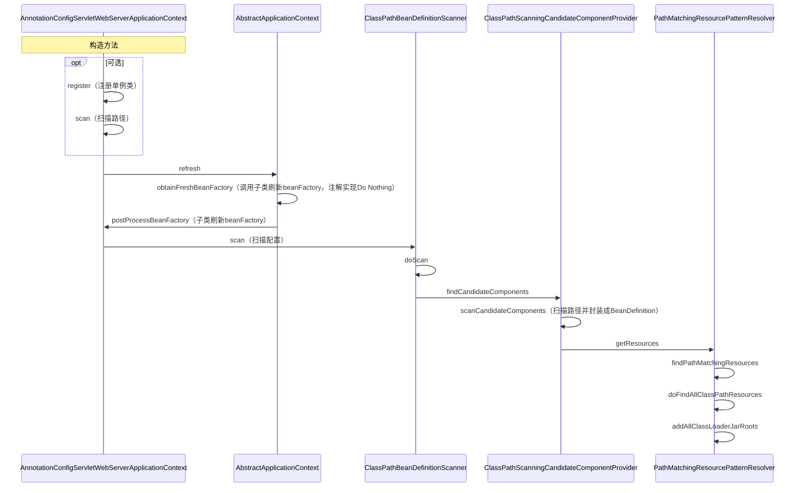
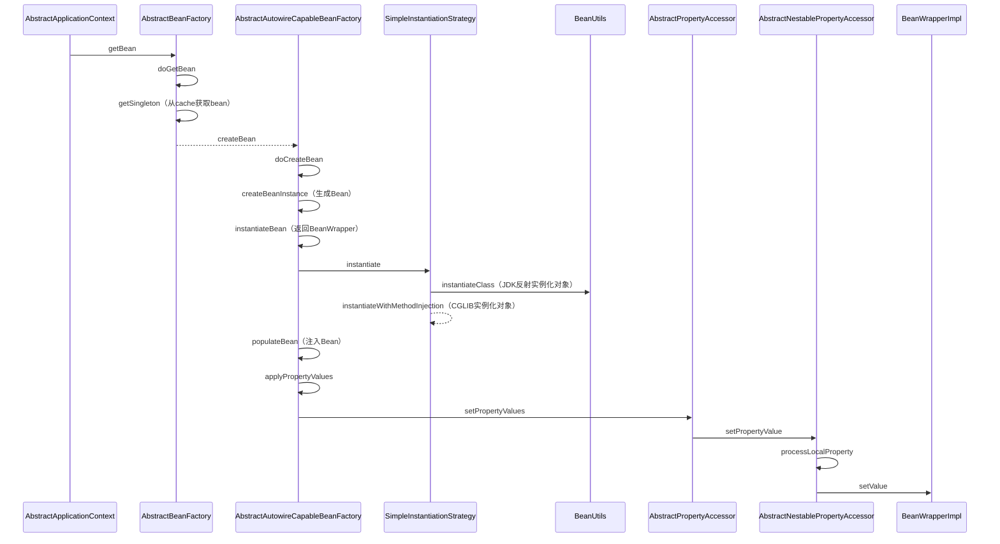
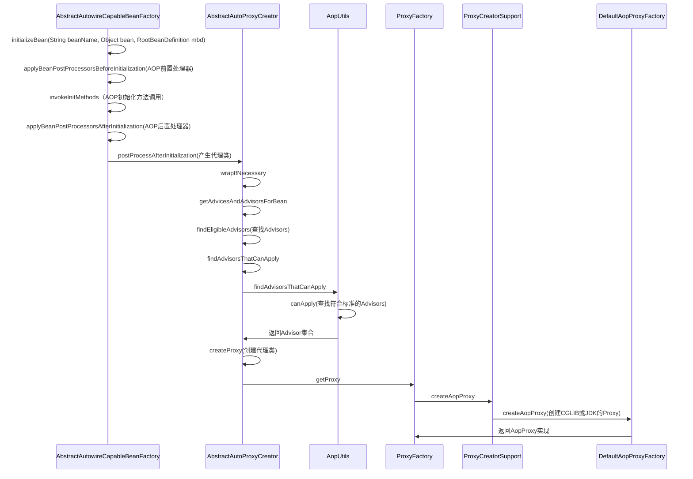
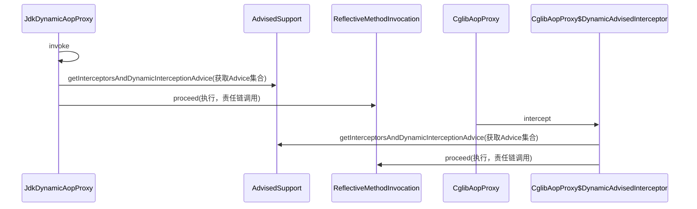
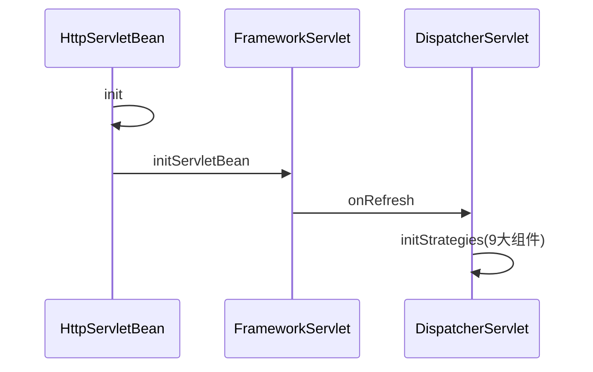

# 设计

## 设计原则

* **开闭原则** 
  * 定义：一个软件实体如类、模块和函数应该对扩展开放，对修改关闭
* 归纳：对扩展开发，对修改关闭
  * 目的：减少维护带来的新的风险
  
* **依赖倒置原则** 
  * 定义：高层模块不应该依赖低层模块，二者都应该依赖其抽象；抽象不应该依赖细节；细节应该依赖抽象
* 归纳：高层不应该底层
  * 目的：更利于代码结构的升级扩展
  
* **单一职责原则**
  * 定义：不要存在多于一个导致类变更的原因
* 归纳：一个类只做一件事
  * 目的：便于理解，提高代码可读性
  
* **接口隔离原则**
  * 定义：客户端不应该依赖它不需要的接口；一个类对另一个类的依赖应该建立在最小的接口上
* 归纳：一个接口只做一件事
  * 目的：功能解耦，高内聚，低耦合
  
* **迪米特法则**
  * 定义：一个对象应该对其他对象保持最少的了解
* 归纳：不该知道的不要知道
  * 目的：只和朋友交流，不和陌生人说话，减少代码臃肿
  
* **里氏替换原则**
  * 定义：如果对每一个类型为 T1的对象 o1，都有类型为 T2 的对象o2，使得以 T1定义的所有程序 P 在所有的对象 o1 都代换成 o2 时，程序 P 的行为没有发生变化，那么类型 T2 是类型 T1 的子类型
* 归纳：子类重写方法功能发生改变，不应该影响父类方法的含义
  * 目的：防止继承泛滥
  
* **组合复用原则**
  * 定义：尽量使用对象的组合，而不是继承关系达到软件复用的目的。
  * 归纳：尽量使用组合实现代码复用，而不是用继承
  * 目的：降低代码耦合

## 设计模式

### 工厂模式Factory

* **简单工厂模式**：

  * ```java
    public class Factory{
      public Object getInstance(String name){
        switch(name){
          case "a":
            return new Object();
          case "b":
            return new Object();
          case "c":
            return new Object();
          default:
            throw new RuntimeException("not found");
        }
      }
    }
    ```

* **抽象工厂模式**：

  * 适用于产品族类库

### 单例模式Singleton

==防止反射破坏（构造器校验；使用枚举），序列化破坏（不实现序列化接口；重写序列化方法），克隆破坏（不实现克隆接口；重写克隆方法）==

* **饿汉式**

  * 初始化时创建单例

* **懒汉式**

  * 使用时创建单例

  * 双重检查锁：

    * ```java
      public class Singleton {
        // volatile防止指令重排
        private volatile static Singleton uniqueSingleton;
        private Singleton() {}
        public Singleton getInstance() {
          if (null == uniqueSingleton) {
            synchronized (Singleton.class) {
              if (null == uniqueSingleton) {
                //会发生指令重排
                uniqueSingleton = new Singleton();
              }
            }
          }
          return uniqueSingleton;
        }
      }
      ```

  * 静态内部类：

    * ```java
      /**
       * init:StaticInnerClassSingleton.class
       * getInstance:StaticInnerClassSingleton$SingletonHolder.class
       */
      public class StaticInnerClassSingleton {
        private StaticInnerClassSingleton() {}
        public static StaticInnerClassSingleton getInstance() {
          return SingletonHolder.STATIC_INNER_CLASS_SINGLETON;
        }
        private static class SingletonHolder {
          private static final StaticInnerClassSingleton STATIC_INNER_CLASS_SINGLETON = new StaticInnerClassSingleton();
        }
      }
      ```

* **注册式**

  * 枚举类
  * 缺点：饿汉式，初始化时创建

### 原型模式Prototype

* 用于创建重复的对象，同时又能保证性能

* ==浅克隆：Object.clone()==
  * ==克隆不走构造器方法==
* ==深克隆：序列化==

### 建造者模式Builder

* 使用多个简单的对象一步一步构建成一个复杂的对象

### 代理模式Proxy

* JDK：被代理对象必须实现一个接口
  * 生成逻辑简单，使用反射
  * 可循环嵌套
* CGLib：被代理对象不需要实现接口
  * 使用fastClass，效率高，性能高，底层没有使用反射
  * ==不能有final方法==
  * 不可循环嵌套（生成final方法）

### 门面模式Facade

* 为多个功能提供一个对外接口

* 举例：网站首页、Controller、Utils、`WebMvcConfigurer`

### 装饰器模式Decorator（包装模式Wrap）

* 允许向一个现有的对象添加新的功能，同时又不改变其结构（一种静态代理）

* 例子：InputStream、OutputStream

* ```java
  public interface Shape {void draw();}
  public abstract class ShapeDecorator implements Shape {
     protected Shape decoratedShape;
     // 装饰器构造器必须带有接口参数
     public ShapeDecorator(Shape decoratedShape){
        this.decoratedShape = decoratedShape;
     }
     public void draw(){
        decoratedShape.draw();
     }  
  }
  /**
  * 装饰器实现类
  */
  public class RedShapeDecorator extends ShapeDecorator {
     public RedShapeDecorator(Shape decoratedShape) {
        super(decoratedShape);     
     }
     @Override
     public void draw() {
        decoratedShape.draw();         
        setRedBorder(decoratedShape);
     }
     private void setRedBorder(Shape decoratedShape){
        System.out.println("Border Color: Red");
     }
  }
  ```


### 享元模式Flyweight

* 主要用于减少创建对象的数量，以减少内存占用和提高性能（类似池化技术、缓存）
* 例子：`Integer.valueOf`
* 扩展：
  * 内部状态：内部属性，不会改变
  * 外部状态：外部属性，会随使用而改变（例如池化的使用状态和释放状态）

### 组合模式Composite

* 将对象组合成树形结构以表示"部分-整体"的层次结构
* 例子：树、目录path

### 适配器模式Adapter

* 例子：变压器、转接头
* `HandlerAdapter`

### 桥接模式Bridge

* 使用组合而不是用继承
* 注重形式上、约定上的连接

* `DriverManager`、序列化的readResolve()

### 委派模式Delegate

* 一种特殊的静态代理
* 例子：`ClassLoader`的双亲委派机制

### 模版方法模式Template

### 策略模式Strategy

### 责任链模式Chain

### 迭代器模式Iterator

### 命令模式Command

例子：`Runnable`

### 状态模式State

* 例子：订单状态
* 应用实现：Spring中的`StateMachine`

### 备忘录模式Memento（快照模式Snapshot）

* 例子：快照回滚

### 中介者模式Mediator（调节者模式）

* 例子：微服务注册中心

### 解释器模式Interpreter

* 定义：给定一个语言，定义它的文法的一种表示，并定义一个解释器，这个解释器使用该表示来解释语言中的句子

* ```java
  ExpressionParser parser= new ExpressionParser();
  Expression expression = parser.parseExpression("1+1");
  System.out.println(expression.getValue());
  ```

### 观察者模式Observer（发布订阅模式）

* JDK的`Observable`,google的`guava`

### 访问者模式Visiter

* JDK`FileVisiter`


# Spring

## Framework

* 作用域（Scope）
  * `singleton`：单例
  * `prototype`：多例
  * `request`：web模块，同一次请求只创建一次
  * `session`：web模块，同一个session只创建一次
* 注册bean的方式
  * `@Bean`
  * `@ComponentScan`
  * `@Import`
  * `FactoryBean`
* Bean生命周期监控
  * `@Bean(value = "bean", initMethod = "init", destroyMethod = "destory")`
  * 实现`InitializingBean`，`DisposableBean`
  * 推荐：`@PostConstruct`，`@PreDestroy`
  * 实现`BeanPostProcessor`，拦截所有bean

## IOC时序图



## DI时序图



## AOP时序图



### 代理调用时序图



## MVC时序图




# 算法

## 全局唯一ID

### `UUID`

* `UUID.randomUUID().toString()`
* 缺点
  * 可能出现重复
  * 无有序的递增

### 数据库

* ```sql
  create table SEQUENCE(
  	SEQ_NAME VARCHAR2(1000),
  	SEQ_COUNT NUMBER(0)
  );
  ```

* 缺点

  * 受限数据库性能瓶颈

### Redis

* incr

### 雪花算法

* 64为int
* 一位不用（为0，表示为正整数）+41位时间戳+10位机器码+12位序列号
* 缺点
  * 基于时间戳生成，产生时钟回拨问题
* 优化
  * 记录最后一次时间戳

### 叶子算法（Leaf）

* Leaf-segment

  * 数据库批量拿取号段
  * 缺点：
    * 号段用完去数据库取号段时受限网络
  * 优化：
    * 采用双Buffer，开启另外一个线程在一定条件下去取号段放到另一个Buffer中

  

## 分布式事务

### 事务模式

* 2PC
  * [AT](http://seata.io/zh-cn/docs/dev/mode/at-mode.html)
    * 单节点故障
    * 性能问题(**所有的参与者资源和协调者资源都是被锁住的**)
* [TCC](http://seata.io/zh-cn/docs/dev/mode/tcc-mode.html)
* [SAGA](http://seata.io/zh-cn/docs/user/saga.html)
* [XA](http://seata.io/zh-cn/docs/dev/mode/xa-mode.html)

* 恢复策略
  * 向前恢复（重试）
  * 向后恢复（回滚）