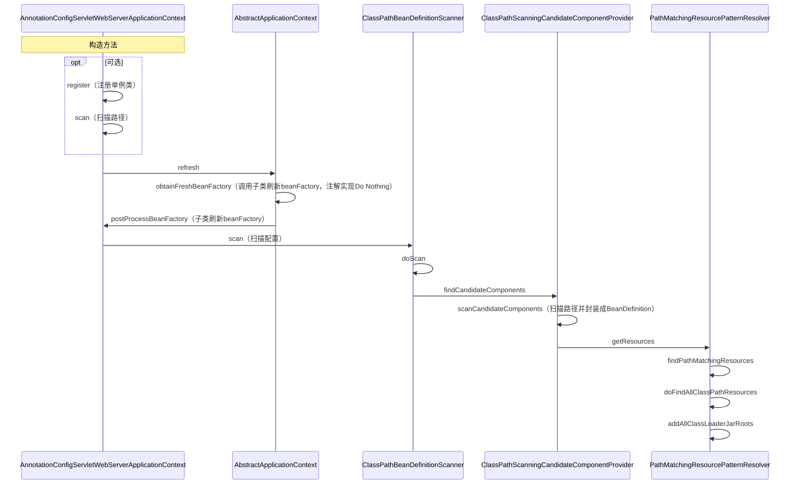
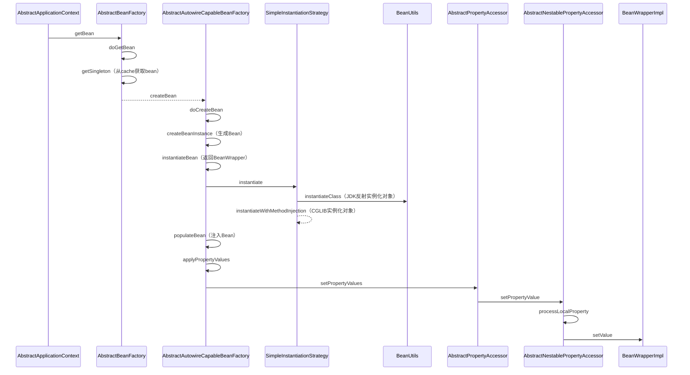
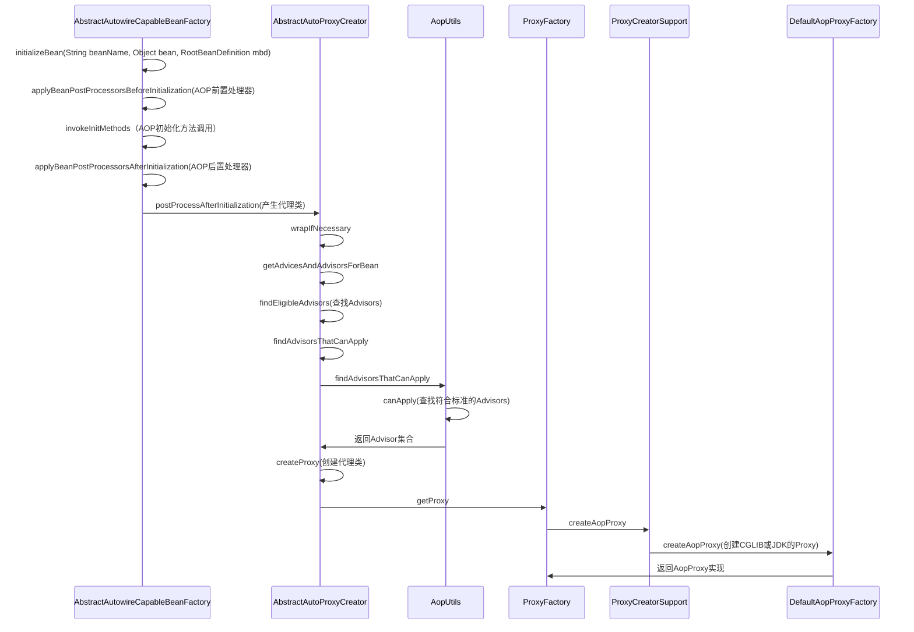
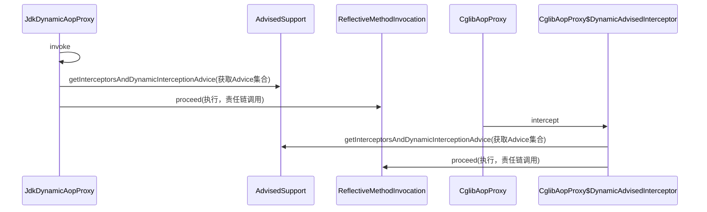
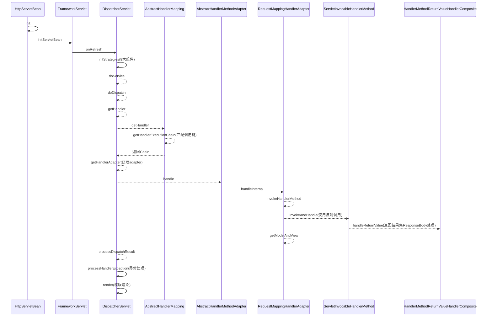

# 设计

## 设计原则

* **开闭原则** 
  * 定义：一个软件实体如类、模块和函数应该对扩展开放，对修改关闭
* 归纳：对扩展开发，对修改关闭
  * 目的：减少维护带来的新的风险
  
* **依赖倒置原则** 
  * 定义：高层模块不应该依赖低层模块，二者都应该依赖其抽象；抽象不应该依赖细节；细节应该依赖抽象
* 归纳：高层不应该底层
  * 目的：更利于代码结构的升级扩展
  
* **单一职责原则**
  * 定义：不要存在多于一个导致类变更的原因
* 归纳：一个类只做一件事
  * 目的：便于理解，提高代码可读性
  
* **接口隔离原则**
  * 定义：客户端不应该依赖它不需要的接口；一个类对另一个类的依赖应该建立在最小的接口上
* 归纳：一个接口只做一件事
  * 目的：功能解耦，高内聚，低耦合
  
* **迪米特法则**
  * 定义：一个对象应该对其他对象保持最少的了解
* 归纳：不该知道的不要知道
  * 目的：只和朋友交流，不和陌生人说话，减少代码臃肿
  
* **里氏替换原则**
  * 定义：如果对每一个类型为 T1的对象 o1，都有类型为 T2 的对象o2，使得以 T1定义的所有程序 P 在所有的对象 o1 都代换成 o2 时，程序 P 的行为没有发生变化，那么类型 T2 是类型 T1 的子类型
* 归纳：子类重写方法功能发生改变，不应该影响父类方法的含义
  * 目的：防止继承泛滥
  
* **组合复用原则**
  * 定义：尽量使用对象的组合，而不是继承关系达到软件复用的目的。
  * 归纳：尽量使用组合实现代码复用，而不是用继承
  * 目的：降低代码耦合

## 设计模式

### 工厂模式Factory

* **简单工厂模式**：

  * ```java
    public class Factory{
      public Object getInstance(String name){
        switch(name){
          case "a":
            return new Object();
          case "b":
            return new Object();
          case "c":
            return new Object();
          default:
            throw new RuntimeException("not found");
        }
      }
    }
    ```

* **抽象工厂模式**：

  * 适用于产品族类库

### 单例模式Singleton

==防止反射破坏（构造器校验；使用枚举），序列化破坏（不实现序列化接口；重写序列化方法），克隆破坏（不实现克隆接口；重写克隆方法）==

* **饿汉式**

  * 初始化时创建单例

* **懒汉式**

  * 使用时创建单例

  * 双重检查锁：

    * ```java
      public class Singleton {
        // volatile防止指令重排
        private volatile static Singleton uniqueSingleton;
        private Singleton() {}
        public Singleton getInstance() {
          if (null == uniqueSingleton) {
            synchronized (Singleton.class) {
              if (null == uniqueSingleton) {
                //会发生指令重排
                uniqueSingleton = new Singleton();
              }
            }
          }
          return uniqueSingleton;
        }
      }
      ```

  * 静态内部类：

    * ```java
      /**
       * init:StaticInnerClassSingleton.class
       * getInstance:StaticInnerClassSingleton$SingletonHolder.class
       */
      public class StaticInnerClassSingleton {
        private StaticInnerClassSingleton() {}
        public static StaticInnerClassSingleton getInstance() {
          return SingletonHolder.STATIC_INNER_CLASS_SINGLETON;
        }
        private static class SingletonHolder {
          private static final StaticInnerClassSingleton STATIC_INNER_CLASS_SINGLETON = new StaticInnerClassSingleton();
        }
      }
      ```

* **注册式**

  * 枚举类
  * 缺点：饿汉式，初始化时创建

### 原型模式Prototype

* 用于创建重复的对象，同时又能保证性能

* ==浅克隆：Object.clone()==
  * ==克隆不走构造器方法==
* ==深克隆：序列化==

### 建造者模式Builder

* 使用多个简单的对象一步一步构建成一个复杂的对象

### 代理模式Proxy

* JDK：被代理对象必须实现一个接口
  * 生成逻辑简单，使用反射
  * 可循环嵌套
* CGLib：被代理对象不需要实现接口
  * 使用fastClass，效率高，性能高，底层没有使用反射
  * ==不能有final方法==
  * 不可循环嵌套（生成final方法）

### 门面模式Facade

* 为多个功能提供一个对外接口

* 举例：网站首页、Controller、Utils、`WebMvcConfigurer`

### 装饰器模式Decorator（包装模式Wrap）

* 允许向一个现有的对象添加新的功能，同时又不改变其结构（一种静态代理）

* 例子：InputStream、OutputStream

* ```java
  public interface Shape {void draw();}
  public abstract class ShapeDecorator implements Shape {
     protected Shape decoratedShape;
     // 装饰器构造器必须带有接口参数
     public ShapeDecorator(Shape decoratedShape){
        this.decoratedShape = decoratedShape;
     }
     public void draw(){
        decoratedShape.draw();
     }  
  }
  /**
  * 装饰器实现类
  */
  public class RedShapeDecorator extends ShapeDecorator {
     public RedShapeDecorator(Shape decoratedShape) {
        super(decoratedShape);     
     }
     @Override
     public void draw() {
        decoratedShape.draw();         
        setRedBorder(decoratedShape);
     }
     private void setRedBorder(Shape decoratedShape){
        System.out.println("Border Color: Red");
     }
  }
  ```


### 享元模式Flyweight

* 主要用于减少创建对象的数量，以减少内存占用和提高性能（类似池化技术、缓存）
* 例子：`Integer.valueOf`
* 扩展：
  * 内部状态：内部属性，不会改变
  * 外部状态：外部属性，会随使用而改变（例如池化的使用状态和释放状态）

### 组合模式Composite

* 将对象组合成树形结构以表示"部分-整体"的层次结构
* 例子：树、目录path

### 适配器模式Adapter

* 例子：变压器、转接头
* `HandlerAdapter`

### 桥接模式Bridge

* 使用组合而不是用继承
* 注重形式上、约定上的连接

* `DriverManager`、序列化的readResolve()

### 委派模式Delegate

* 一种特殊的静态代理
* 例子：`ClassLoader`的双亲委派机制

### 模版方法模式Template

### 策略模式Strategy

### 责任链模式Chain

### 迭代器模式Iterator

### 命令模式Command

例子：`Runnable`

### 状态模式State

* 例子：订单状态
* 应用实现：Spring中的`StateMachine`

### 备忘录模式Memento（快照模式Snapshot）

* 例子：快照回滚

### 中介者模式Mediator（调节者模式）

* 例子：微服务注册中心

### 解释器模式Interpreter

* 定义：给定一个语言，定义它的文法的一种表示，并定义一个解释器，这个解释器使用该表示来解释语言中的句子

* ```java
  ExpressionParser parser= new ExpressionParser();
  Expression expression = parser.parseExpression("1+1");
  System.out.println(expression.getValue());
  ```

### 观察者模式Observer（发布订阅模式）

* JDK的`Observable`,google的`guava`

### 访问者模式Visiter

* JDK`FileVisiter`


# Spring

## Framework

* 作用域（Scope）
  * `singleton`：单例
  * `prototype`：多例
  * `request`：web模块，同一次请求只创建一次
  * `session`：web模块，同一个session只创建一次
* 注册bean的方式
  * `@Bean`
  * `@ComponentScan`
  * `@Import`
  * `FactoryBean`
* Bean生命周期监控
  * `@Bean(value = "bean", initMethod = "init", destroyMethod = "destory")`
  * 实现`InitializingBean`，`DisposableBean`
  * 推荐：`@PostConstruct`，`@PreDestroy`
  * 实现`BeanPostProcessor`，拦截所有bean

## IOC时序图



## DI时序图



## AOP时序图



### 代理调用时序图



## MVC时序图



## 面试题

**1、使用Spring框架能给我们带来哪些好处？**

* 简化开发
  * 提供许多内置的解决方案（BOP（面向Bean编程），IoC，AOP）
  * 声明式事物管理，使用`TransactionManager`
  * 围绕Spring生态提供许多工具类，比如`RestTemplate`，`JdbcTemplate`

**2、`BeanFactory`和`ApplicationContext`的区别？**

* `ApplicationContext`是`BeanFactory`的实现类

* `BeanFactory`是顶层设计接口。`ApplicationContext`是用户设计接口，使用了门面模式，实现了`BeanFactory`，`MessageSource`、`ApplicationEventPublisher`、`EnvironmentCapable`

**3、Spring的生命周期？**

* 单例：Spring容器启动时候加载，Spring容器销毁时销毁，如果是延时加载，在调用前创建

* 原型：在调用前创建，调用后销毁

**4、Spring中用到哪些设计模式？**

工厂模式、单例模式（容器式单例）、原型模式（容器式多例）、代理模式、迭代器模式、享元模式（各种Cache）、门面模式（`ApplicationContext`）、委派模式、解释器模式（spring的`Expression`包）、建造者模式、责任链模式（`Filter`）、观察者模式（发布订阅模式）、适配器模式（`HandlerAdapter`） 、策略模式（`ContentNegotiationStrategy`解析MVC 中media type）、模板模式（各种钩子方法）

**5、Spring、Spring Boot、Spring Cloud区别？**

* Spring ：基础框架，包含日常开发所需的所有功能
* Spring Boot：
  * 约定优于配置，官方约定的一整套开发所需的配置，官方提供的脚手架，简化开发，开箱即用
  * 集成Web容器，直接jar包运行

* Spring Cloud：
  * 进军分布式生态：注册中心、服务发现、链路跟踪、配置中心、负载均衡、熔断策略等
* Spring Cloud 依赖Sping Boot 依赖Spring


# Mybatis

## 缓存


* 一级缓存
  * Session级别
  * 默认开启
  * 
* 二级缓存
  * namespace级别
  * 配置默认开启，`mapper.xml`配置文件添加`<cache/>`
  * 默认使用内存缓存，可以使用第三方缓存
  * commit后才写入缓存


# 算法

## 全局唯一ID

### `UUID`

* `UUID.randomUUID().toString()`
* 缺点
  * 可能出现重复
  * 无有序的递增

### 数据库

* ```sql
  create table SEQUENCE(
  	SEQ_NAME VARCHAR2(1000),
  	SEQ_COUNT NUMBER(0)
  );
  ```

* 缺点

  * 受限数据库性能瓶颈

### Redis

* incr

### 雪花算法

* 64为int
* 一位不用（为0，表示为正整数）+41位时间戳+10位机器码+12位序列号
* 缺点
  * 基于时间戳生成，产生时钟回拨问题
* 优化
  * 记录最后一次时间戳

### 叶子算法（Leaf）

* Leaf-segment

  * 数据库批量拿取号段
  * 缺点：
    * 号段用完去数据库取号段时受限网络
  * 优化：
    * 采用双Buffer，开启另外一个线程在一定条件下去取号段放到另一个Buffer中

  

## 分布式事务

### 事务模式

* 2PC
  * [AT](http://seata.io/zh-cn/docs/dev/mode/at-mode.html)
    * 单节点故障
    * 性能问题(**所有的参与者资源和协调者资源都是被锁住的**)
* [TCC](http://seata.io/zh-cn/docs/dev/mode/tcc-mode.html)
* [SAGA](http://seata.io/zh-cn/docs/user/saga.html)
* [XA](http://seata.io/zh-cn/docs/dev/mode/xa-mode.html)

* 恢复策略
  * 向前恢复（重试）
  * 向后恢复（回滚）


# Zookeeper

## ZAB协议

* Zab协议 的全称是 **Zookeeper Atomic Broadcast** （Zookeeper原子广播）
* zxid
  * 64位数字
  * 高32位代表了 Leader 周期的 epoch 编号，每次+1
  * 低32位代表计数器，每次+1

### ZAB状态

#### 崩溃恢复

* 当整个服务框架在启动中，或者当Leader服务器出现网络中断、崩溃退出与重启等异常情况时，zab协议就会进入崩溃恢复模式并选举出新的Leader服务器
* 崩溃恢复要求
  * **确保已经被 Leader 提交的 Proposal 必须最终被所有的 Follower 服务器提交**
  * **确保丢弃已经被 Leader 提出的但是没有被提交的 Proposal**
* Leader选举
  * 新选举的 Leader 必须都是已经提交了 Proposal 的 Follower 服务器节点
  * 新选举的 Leader 节点中含有最大的 zxid
* 数据恢复
  * **Leader未提交的数据同步**：B在成为Leader后，先判断自身未Commit的消息（本例中即P3）是否存在于大多数服务器中从而决定是否要将其Commit。然后B可得出自身所包含的被Commit过的消息中的最小zxid（记为**min_zxid**）与最大zxid（记为**max_zxid**）
  * **Follower同步**：最后的处理的zxid与L的min_zxid和max_zxid对比。
    * DIFF直接差异化同步：min_zxid<zxid<max_zxid
    * TRUNC仅回滚同步：zxid>max_zxid
    * SNAP全量同步：zxid<min_zxid
    * TRUNC+DIFF先回滚再差异化同步：原Leader提交后没有发给F就挂了，重启后须回滚该提交
  * **如何处理需要丢弃的 Proposal**：F的最后的提交请求与L对比，F执行回退操作

#### 消息广播

* Leader与每个F之间分配一个单独队列，根据FIFO发送消息

* Leader作为全局唯一服务器处理写请求，当提交数过半视为成功提交，并返回。

### CAP

#### 一致性

* **读一致性**：当Client向zookeeper发出读请求时，无论是Leader还是Follower，都直接返回查询结果，**所以读取到的数据可能是过期的旧数据，不是最新的数据**（因为只要半数成功就算写入成功）。如果客户端A和客户端B读取相同的值很重要，则客户端B应该在执行读取之前从ZooKeeper API方法调用sync()方法。
  * sync方法的解释：异步的实现当前进程与leader之间的指定path的数据同步
* **写一致性**：
  * 写入请求发送到Follower节点时，Follower节点将请求转发给Leader

#### 可用性

* 崩溃恢复状态时，服务不可用
* java GC的STW

# ETCD

## RAFT算法

* **Leader选举**

  * 随机时钟，到时发起选举
  * RPC
    * **RequestVote RPC**：**候选人在选举期间发起**。
    * **AppendEntries RPC**：**领导人发起的一种心跳机制，复制日志也在该命令中完成**。
    * **InstallSnapshot RPC**: **领导者使用该RPC来发送快照给太落后的追随者**。
  * 日志组成：**任期号（term）**+**有序编号（log index）**+**状态机执行的命令**
  * **确保当选的leader包含所有日志**：在RequestVote中只会投给比大于等于自己最新日志的candidate

* **日志复制**

  * 流程
    * 客户端向leader发起，向follower发起的会转发给leader
    * leader 把这个指令作为一条新的日志条目**添加到日志**中，然后并行发起 RPC 给其他的服务器，让他们复制这条信息。
    * 假如这条日志被安全的复制，领导人就**应用这条日志到自己的状态机**中，并返回给客户端。
    * 如果 follower 宕机或者运行缓慢或者丢包，领导人会不断的重试，知道所有的 follower 最终都存储了所有的日志条目。
  * **当 leader 和 follower 日志冲突的时候**，leader 将**校验 follower 最后一条日志是否和 leader 匹配**，如果不匹配，**将递减查询，直到匹配，匹配后，删除冲突的日志**

* **日志压缩**

  * **日志元数据，最后一条已提交的 log entry的 log index和term**。这两个值在snapshot之后的第一条log entry的AppendEntries RPC的完整性检查的时候会被用上。
  * **系统当前状态**。
  * 当Leader要发给某个日志落后太多的Follower的log entry被丢弃，Leader会将snapshot发给Follower。或者当新加进一台机器时，也会发送snapshot给它。发送snapshot使用InstalledSnapshot RPC。
  * 做snapshot既不要做的太频繁，否则**消耗磁盘带宽**， 也不要做的太不频繁，否则一旦节点重启需要回放大量日志，影响可用性。**推荐当日志达到某个固定的大小做一次snapshot**。
  * 做一次snapshot可能耗时过长，会影响正常日志同步。可以通过使用copy-on-write技术避免snapshot过程影响正常日志同步。

* 读写

  * 3.0：
    * 写操作成功仅仅以为着写操作被 commit 到日志上，并不能确保当前全局的状态机已经 apply 了该写日志。而状态机 apply 日志的过程相对于 commit 操作是异步的，因此在 commit 后立即读取状态机可能会读到过期数据。
    * 为了保证线性一致性读，早期的 etcd（**etcd v3.0** ）对所有的读写请求都会走一遍 Raft 协议来满足强一致性。然而通常在现实使用中，读请求占了 etcd 所有请求中的绝大部分，如果每次读请求都要走一遍 raft 协议落盘，etcd 性能将非常差。
  * 3.1：
    * **每次读操作时记录此时集群的 commit index，当状态机的 apply index 大于或者等于 commit index 时即可返回数据**
    * 集群的 commit index为**ReadIndex** 
      * 为了获取ReadIndex
        * **让 Leader 处理 ReadIndex 请求**
        * **广播一次，保证 Leader 仍然是目前的 Leader**

  * 3.2：
    * 锁细化
    * 添加buffer
  * 

# 分布式锁

* **redis**

  * 单机：SET key value NX PX milliseconds。缺点：单点故障

  * Master-Slave：加锁的时候只对一个节点加锁，即便通过 Sentinel 做了高可用，但是如果 Master 节点故障了，发生主从切换，此时就会有可能出现锁丢失的问题。

  * Redis Cluster 模式：RedLock

    - 尝试在大多数节点上建立一个锁，比如 5 个节点就要求是 3 个节点（n / 2 +1）。

    * **缺点**：
      * 因为redis在进行主从复制时是异步完成的，比如在clientA获取锁后，主redis复制数据到从redis过程中崩溃了，导致没有复制到从redis中，然后从redis选举出一个升级为主redis,造成新的主redis没有clientA 设置的锁，这是clientB尝试获取锁，并且能够成功获取锁，导致互斥失效；
      * 时钟漂移相对TTL超时时间不可忽略的情况下。

* **zookeeper**
  * 在永久节点创建临时顺序节点，并watch上一个节点。如果序号最小则获取锁。释放时删除节点