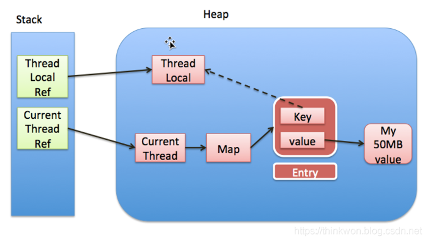

# 设计

## 设计原则

* **开闭原则** 
  * 定义：一个软件实体如类、模块和函数应该对扩展开放，对修改关闭
  * 归纳：对扩展开发，对修改关闭
  * 目的：减少维护带来的新的风险
  
* **依赖倒置原则** 
  * 定义：高层模块不应该依赖低层模块，二者都应该依赖其抽象；抽象不应该依赖细节；细节应该依赖抽象
  * 归纳：高层不应该底层
  * 目的：更利于代码结构的升级扩展
  
* **单一职责原则**
  * 定义：不要存在多于一个导致类变更的原因
  * 归纳：一个类只做一件事
  * 目的：便于理解，提高代码可读性
  
* **接口隔离原则**
  * 定义：客户端不应该依赖它不需要的接口；一个类对另一个类的依赖应该建立在最小的接口上
  * 归纳：一个接口只做一件事
  * 目的：功能解耦，高内聚，低耦合
  
* **迪米特法则**
  * 定义：一个对象应该对其他对象保持最少的了解
  * 归纳：不该知道的不要知道
  * 目的：只和朋友交流，不和陌生人说话，减少代码臃肿
  
* **里氏替换原则**
  * 定义：如果对每一个类型为 T1的对象 o1，都有类型为 T2 的对象o2，使得以 T1定义的所有程序 P 在所有的对象 o1 都代换成 o2 时，程序 P 的行为没有发生变化，那么类型 T2 是类型 T1 的子类型
  * 归纳：子类重写方法功能发生改变，不应该影响父类方法的含义
  * 目的：防止继承泛滥
  
* **组合复用原则**
  * 定义：尽量使用对象的组合，而不是继承关系达到软件复用的目的。
  * 归纳：尽量使用组合实现代码复用，而不是用继承
  * 目的：降低代码耦合

## 设计模式

### 工厂模式Factory

* **简单工厂模式**：

  * ```java
    public class Factory{
      public Object getInstance(String name){
        switch(name){
          case "a":
            return new Object();
          case "b":
            return new Object();
          case "c":
            return new Object();
          default:
            throw new RuntimeException("not found");
        }
      }
    }
    ```

* **抽象工厂模式**：

  * 适用于产品族类库

### 单例模式Singleton

==防止反射破坏（构造器校验；使用枚举），序列化破坏（不实现序列化接口；重写序列化方法），克隆破坏（不实现克隆接口；重写克隆方法）==

* **饿汉式**

  * 初始化时创建单例

* **懒汉式**

  * 使用时创建单例

  * 双重检查锁：

    * ```java
      public class Singleton {
        // volatile防止指令重排
        private volatile static Singleton uniqueSingleton;
        private Singleton() {}
        public Singleton getInstance() {
          if (null == uniqueSingleton) {
            synchronized (Singleton.class) {
              if (null == uniqueSingleton) {
                //会发生指令重排
                uniqueSingleton = new Singleton();
              }
            }
          }
          return uniqueSingleton;
        }
      }
      ```

  * 静态内部类：

    * ```java
      /**
       * init:StaticInnerClassSingleton.class
       * getInstance:StaticInnerClassSingleton$SingletonHolder.class
       */
      public class StaticInnerClassSingleton {
        private StaticInnerClassSingleton() {}
        public static StaticInnerClassSingleton getInstance() {
          return SingletonHolder.STATIC_INNER_CLASS_SINGLETON;
        }
        private static class SingletonHolder {
          private static final StaticInnerClassSingleton STATIC_INNER_CLASS_SINGLETON = new StaticInnerClassSingleton();
        }
      }
      ```

* **注册式**

  * 枚举类
  * 缺点：饿汉式，初始化时创建

### 原型模式Prototype

* 用于创建重复的对象，同时又能保证性能

* ==浅克隆：Object.clone()==
  * ==克隆不走构造器方法==
* ==深克隆：序列化==

### 建造者模式Builder

* 使用多个简单的对象一步一步构建成一个复杂的对象

### 代理模式Proxy

* JDK：被代理对象必须实现一个接口
  * 生成逻辑简单，使用反射
  * 可循环嵌套
* CGLib：被代理对象不需要实现接口
  * 使用fastClass，效率高，性能高，底层没有使用反射
  * ==不能有final方法==
  * 不可循环嵌套（生成final方法）

### 门面模式Facade

* 为多个功能提供一个对外接口

* 举例：网站首页、Controller、Utils、`WebMvcConfigurer`

### 装饰器模式Decorator（包装模式Wrap）

* 允许向一个现有的对象添加新的功能，同时又不改变其结构（一种静态代理）

* 例子：InputStream、OutputStream

* ```java
  public interface Shape {void draw();}
  public abstract class ShapeDecorator implements Shape {
     protected Shape decoratedShape;
     // 装饰器构造器必须带有接口参数
     public ShapeDecorator(Shape decoratedShape){
        this.decoratedShape = decoratedShape;
     }
     public void draw(){
        decoratedShape.draw();
     }  
  }
  /**
  * 装饰器实现类
  */
  public class RedShapeDecorator extends ShapeDecorator {
     public RedShapeDecorator(Shape decoratedShape) {
        super(decoratedShape);     
     }
     @Override
     public void draw() {
        decoratedShape.draw();         
        setRedBorder(decoratedShape);
     }
     private void setRedBorder(Shape decoratedShape){
        System.out.println("Border Color: Red");
     }
  }
  ```


### 享元模式Flyweight

* 主要用于减少创建对象的数量，以减少内存占用和创建对象的消耗提高性能（类似池化技术、常量池）
* 例子：
  * `Integer、Long、Short`的`valueOf`
  * 线程池、数据库连接池
* 扩展：
  * 内部状态：内部属性，不会改变
  * 外部状态：外部属性，会随使用而改变（例如池化的使用状态和释放状态）

### 组合模式Composite

* 将对象组合成树形结构以表示"部分-整体"的层次结构
* 例子：树、目录path

### 适配器模式Adapter

* 例子：变压器、转接头
* `HandlerAdapter`

### 桥接模式Bridge

* 使用组合而不是用继承
* 注重形式上、约定上的连接

* `DriverManager`、序列化的readResolve()

### 委派模式Delegate

* 一种特殊的静态代理
* 例子：`ClassLoader`的双亲委派机制

### 模版方法模式Template

### 策略模式Strategy

### 责任链模式Chain

### 迭代器模式Iterator

### 命令模式Command

例子：`Runnable`

### 状态模式State

* 例子：订单状态
* 应用实现：Spring中的`StateMachine`

### 备忘录模式Memento（快照模式Snapshot）

* 例子：快照回滚

### 中介者模式Mediator（调节者模式）

* 例子：微服务注册中心

### 解释器模式Interpreter

* 定义：给定一个语言，定义它的文法的一种表示，并定义一个解释器，这个解释器使用该表示来解释语言中的句子

* ```java
  ExpressionParser parser= new ExpressionParser();
  Expression expression = parser.parseExpression("1+1");
  System.out.println(expression.getValue());
  ```

### 观察者模式Observer（发布订阅模式）

* JDK的`Observable`,google的`guava`

### 访问者模式Visiter

* JDK`FileVisiter`


# Spring

## Framework

* 作用域（Scope）
  * `singleton`：单例
  * `prototype`：多例
  * `request`：web模块，同一次请求只创建一次
  * `session`：web模块，同一个session只创建一次
* 注册bean的方式
  * `@Bean`
  * `@ComponentScan`
  * `@Import`
  * `FactoryBean`
* Bean生命周期监控
  * `@Bean(value = "bean", initMethod = "init", destroyMethod = "destory")`
  * 实现`InitializingBean`，`DisposableBean`
  * 推荐：`@PostConstruct`，`@PreDestroy`
  * 实现`BeanPostProcessor`，拦截所有bean

## IOC时序图


## DI时序图


## AOP时序图


## 代理调用时序图


## MVC时序图


## 面试题

**1、使用Spring框架能给我们带来哪些好处？**

* 简化开发
  * 提供许多内置的解决方案（BOP（面向Bean编程），IoC，AOP）
  * 声明式事物管理，使用`TransactionManager`
  * 围绕Spring生态提供许多工具类，比如`RestTemplate`，`JdbcTemplate`

**2、`BeanFactory`和`ApplicationContext`的区别？**

* `ApplicationContext`是`BeanFactory`的实现类

* `BeanFactory`是顶层设计接口。`ApplicationContext`是用户设计接口，使用了门面模式，实现了`BeanFactory`，`MessageSource`、`ApplicationEventPublisher`、`EnvironmentCapable`

**3、Spring的生命周期？**

* 单例：Spring容器启动时候加载，Spring容器销毁时销毁，如果是延时加载，在调用前创建

* 原型：在调用前创建，调用后销毁

**4、Spring中用到哪些设计模式？**

工厂模式、单例模式（容器式单例）、原型模式（容器式多例）、代理模式、迭代器模式、享元模式（各种Cache）、门面模式（`ApplicationContext`）、委派模式、解释器模式（spring的`Expression`包）、建造者模式、责任链模式（`Filter`）、观察者模式（发布订阅模式）、适配器模式（`HandlerAdapter`） 、策略模式（`ContentNegotiationStrategy`解析MVC 中media type）、模板模式（各种钩子方法）

**5、Spring、Spring Boot、Spring Cloud区别？**

* Spring ：基础框架，包含日常开发所需的所有功能
* Spring Boot：
  * 约定优于配置，官方约定的一整套开发所需的配置，官方提供的脚手架，简化开发，开箱即用
  * 集成Web容器，直接jar包运行

* Spring Cloud：
  * 进军分布式生态：注册中心、服务发现、链路跟踪、配置中心、负载均衡、熔断策略等
* Spring Cloud 依赖Sping Boot 依赖Spring


# Mybatis

## 缓存


* 一级缓存
  * Session级别
  * 默认开启
* 二级缓存
  * namespace级别
  * 配置默认开启，`mapper.xml`配置文件添加`<cache/>`
  * 默认使用内存缓存，可以使用第三方缓存
  * commit后才写入缓存


# 算法

## 全局唯一ID

### `UUID`

* `UUID.randomUUID().toString()`
* 缺点
  * 可能出现重复
  * 无有序的递增

### 数据库

* ```sql
  create table SEQUENCE(
  	SEQ_NAME VARCHAR2(1000),
  	SEQ_COUNT NUMBER(0)
  );
  ```

* 缺点

  * 受限数据库性能瓶颈

### 数据库集群

* 设置初始值和步长，解决单点故障问题

### 号段模式

* 从数据库批量获取id

### Redis

* incr

### 雪花算法

* 64为int
* 一位不用（为0，表示为正整数）+41位时间戳+10位机器码+12位序列号
* 缺点
  * 基于时间戳生成，产生时钟回拨问题
* 优化
  * 记录最后一次时间戳

### 叶子算法（Leaf）

* Leaf-segment

  * 数据库批量拿取号段
  * 缺点：
    * 号段用完去数据库取号段时受限网络
  * 优化：
    * 采用双Buffer，开启另外一个线程在一定条件下去取号段放到另一个Buffer中

  

# 分布式事务

## 协议

### XA-2PC

* 阶段
  * 准备命令
  * 提交/回滚
* 缺陷
  * 同步阻塞
    * 从第一阶段开始就拿到本地锁，参与者越多，阻塞越严重
  * 单点故障
    * TM是单点
  * 数据不一致
    * 发生网络问题，部分参与者没有收到提交消息

### 3PC

* 比2PC多了一个health阶段（CanCommit），提前校验节点是否正常，避免下阶段长时间持有锁
* 引入超时机制，参与者没有收到长时间没收到协调者请求，自动commit
* 缺陷
  * 数据不一致
    * 默认commit，如果TM发送的是abort

### TCC

* 2PC的业务层版本
* 注意事项
  * 允许空回滚
    * Try未执行，就执行cancel、此时cancel必须正常返回
  * 幂等
  * 资源悬挂
    * try未执行，cancel执行后，try再执行；使用状态机，cancel插入回滚状态

### AT

* 写过程
  * 一阶段：获取本地锁、执行sql、获取全局锁、提交、释放本地锁；拦截解析sql、生成"before image"、执行sql、生成"after image"
  * 二阶段：释放全局锁，异步删除undo log日志；获取本地锁，校验镜像数据，反向补偿更新
* 读过程
  * 默认读未提交
  * 使用SELECT FOR UPDATE实现读已提交，会申请全局锁
* 缺陷：
  * 第二阶段校验失败
    * 人工干预
    * 重试
  * 第二阶段ABA问题

### SAGA

* 实现方式
  * 状态机
  * 注解+拦截器

* 使用场景
  * 业务流程长、业务流程多
  * 参与者包含其它公司或遗留系统服务，无法提供 TCC 模式要求的三个接口
* 优势
  * 一阶段提交本地事务，无锁，高性能
  * 事件驱动架构，参与者可异步执行，高吞吐
  * 补偿服务易于实现
* 缺点
  * 不保证隔离性，出现脏写
    * 人工干预
    * 重试

### MQ


## 事务模式

* 2PC
  * [AT](http://seata.io/zh-cn/docs/dev/mode/at-mode.html)
    * 单节点故障
    * 性能问题(**所有的参与者资源和协调者资源都是被锁住的**)
* [TCC](http://seata.io/zh-cn/docs/dev/mode/tcc-mode.html)
* [SAGA](http://seata.io/zh-cn/docs/user/saga.html)
* [XA](http://seata.io/zh-cn/docs/dev/mode/xa-mode.html)

* 恢复策略
  * 向前恢复（重试）
  * 向后恢复（回滚）


# Zookeeper

## ZAB协议

* Zab协议 的全称是 **Zookeeper Atomic Broadcast** （Zookeeper原子广播）
* zxid
  * 64位数字
  * 高32位代表了 Leader 周期的 epoch 编号，每次+1
  * 低32位代表计数器，每次+1

### ZAB状态

#### 崩溃恢复

* 当整个服务框架在启动中，或者当Leader服务器出现网络中断、崩溃退出与重启等异常情况时，zab协议就会进入崩溃恢复模式并选举出新的Leader服务器
* 崩溃恢复要求
  * **确保已经被 Leader 提交的 Proposal 必须最终被所有的 Follower 服务器提交**
  * **确保丢弃已经被 Leader 提出的但是没有被提交的 Proposal**
* Leader选举
  * 新选举的 Leader 必须都是已经提交了 Proposal 的 Follower 服务器节点
  * 新选举的 Leader 节点中含有最大的 zxid
* 数据恢复
  * **Leader未提交的数据同步**：B在成为Leader后，先判断自身未Commit的消息（本例中即P3）是否存在于大多数服务器中从而决定是否要将其Commit。然后B可得出自身所包含的被Commit过的消息中的最小zxid（记为**min_zxid**）与最大zxid（记为**max_zxid**）
  * **Follower同步**：最后的处理的zxid与L的min_zxid和max_zxid对比。
    * DIFF直接差异化同步：min_zxid<zxid<max_zxid
    * TRUNC仅回滚同步：zxid>max_zxid
    * SNAP全量同步：zxid<min_zxid
    * TRUNC+DIFF先回滚再差异化同步：原Leader提交后没有发给F就挂了，重启后须回滚该提交
  * **如何处理需要丢弃的 Proposal**：F的最后的提交请求与L对比，F执行回退操作

#### 消息广播

* Leader与每个F之间分配一个单独队列，根据FIFO发送消息

* Leader作为全局唯一服务器处理写请求，当提交数过半视为成功提交，并返回。

### CAP

#### 一致性

* **读一致性**：当Client向zookeeper发出读请求时，无论是Leader还是Follower，都直接返回查询结果，**所以读取到的数据可能是过期的旧数据，不是最新的数据**（因为只要半数成功就算写入成功）。如果客户端A和客户端B读取相同的值很重要，则客户端B应该在执行读取之前从ZooKeeper API方法调用sync()方法。
  * sync方法的解释：异步的实现当前进程与leader之间的指定path的数据同步
* **写一致性**：
  * 写入请求发送到Follower节点时，Follower节点将请求转发给Leader

#### 可用性

* 崩溃恢复状态时，服务不可用
* java GC的STW

# ETCD

## RAFT算法

* **Leader选举**

  * 随机时钟，到时发起选举
  * RPC
    * **RequestVote RPC**：**候选人在选举期间发起**。
    * **AppendEntries RPC**：**领导人发起的一种心跳机制，复制日志也在该命令中完成**。
    * **InstallSnapshot RPC**: **领导者使用该RPC来发送快照给太落后的追随者**。
  * 日志组成：**任期号（term）**+**有序编号（log index）**+**状态机执行的命令**
  * **确保当选的leader包含所有日志**：在RequestVote中只会投给比大于等于自己最新日志的candidate

* **日志复制**

  * 流程
    * 客户端向leader发起，向follower发起的会转发给leader
    * leader 把这个指令作为一条新的日志条目**添加到日志**中，然后并行发起 RPC 给其他的服务器，让他们复制这条信息。
    * 假如这条日志被安全的复制，领导人就**应用这条日志到自己的状态机**中，并返回给客户端。
    * 如果 follower 宕机或者运行缓慢或者丢包，领导人会不断的重试，知道所有的 follower 最终都存储了所有的日志条目。
  * **当 leader 和 follower 日志冲突的时候**，leader 将**校验 follower 最后一条日志是否和 leader 匹配**，如果不匹配，**将递减查询，直到匹配，匹配后，删除冲突的日志**

* **日志压缩**

  * **日志元数据，最后一条已提交的 log entry的 log index和term**。这两个值在snapshot之后的第一条log entry的AppendEntries RPC的完整性检查的时候会被用上。
  * **系统当前状态**。
  * 当Leader要发给某个日志落后太多的Follower的log entry被丢弃，Leader会将snapshot发给Follower。或者当新加进一台机器时，也会发送snapshot给它。发送snapshot使用InstalledSnapshot RPC。
  * 做snapshot既不要做的太频繁，否则**消耗磁盘带宽**， 也不要做的太不频繁，否则一旦节点重启需要回放大量日志，影响可用性。**推荐当日志达到某个固定的大小做一次snapshot**。
  * 做一次snapshot可能耗时过长，会影响正常日志同步。可以通过使用copy-on-write技术避免snapshot过程影响正常日志同步。

* 读写

  * 3.0：
    * 写操作成功仅仅以为着写操作被 commit 到日志上，并不能确保当前全局的状态机已经 apply 了该写日志。而状态机 apply 日志的过程相对于 commit 操作是异步的，因此在 commit 后立即读取状态机可能会读到过期数据。
    * 为了保证线性一致性读，早期的 etcd（**etcd v3.0** ）对所有的读写请求都会走一遍 Raft 协议来满足强一致性。然而通常在现实使用中，读请求占了 etcd 所有请求中的绝大部分，如果每次读请求都要走一遍 raft 协议落盘，etcd 性能将非常差。
  * 3.1：
    * **每次读操作时记录此时集群的 commit index，当状态机的 apply index 大于或者等于 commit index 时即可返回数据**
    * 集群的 commit index为**ReadIndex** 
      * 为了获取ReadIndex
        * **让 Leader 处理 ReadIndex 请求**
        * **广播一次，保证 Leader 仍然是目前的 Leader**

  * 3.2：
    * 锁细化
    * 添加buffer

# 分布式锁

* **redis**

  * 单机：SET key value NX PX milliseconds。缺点：单点故障

  * Master-Slave：加锁的时候只对一个节点加锁，即便通过 Sentinel 做了高可用，但是如果 Master 节点故障了，发生主从切换，此时就会有可能出现锁丢失的问题。

  * Redis Cluster 模式：RedLock

    - 尝试在大多数节点上建立一个锁，比如 5 个节点就要求是 3 个节点（n / 2 +1）。

    * **缺点**：
      * 因为redis在进行主从复制时是异步完成的，比如在clientA获取锁后，主redis复制数据到从redis过程中崩溃了，导致没有复制到从redis中，然后从redis选举出一个升级为主redis,造成新的主redis没有clientA 设置的锁，这是clientB尝试获取锁，并且能够成功获取锁，导致互斥失效；
      * 时钟漂移相对TTL超时时间不可忽略的情况下。

* **zookeeper**
  
  * 在永久节点创建临时顺序节点，并watch上一个节点。如果序号最小则获取锁。释放时删除节点

# Java

## JDK

### HashMap

* 通过hashCode方法获取hash（`h ^ (h >>> 16)`高16位与低16位异或，`h & (length-1)` 取模），并通过equals判断是否相等

* 7
  * 头插
    * 并发下容易产生环
  * 数组+链表
* 8
  * 尾插
  * 数组+链表+红黑树
  * 到8转换成红黑树，减到6转回链表

### ThreadLocal

* `ThreadLocalMap`弱引用
* 
* 缺陷
  
  * 弱引用照成的内存泄漏
  * 代码改进：

    * `java.lang.ThreadLocal.ThreadLocalMap#replaceStaleEntry`
* 为什么使用弱引用
    * 当threadLocal置空时达到gc`ThreadLocal`的目的

# JVM

## 组成

* 类加载器（ClassLoader）
* 运行时数据区（Runtime Data Area）
* 执行引擎（Execution Engine）
* 本地库接口（Native Interface）

## 类加载机制

* 过程
  * 加载
    * 从各个地方加载
  * 验证
    * 确保Class文件字节流符合虚拟机要求
  * 准备
    * 正式为类变量分配内存并设置类变量的初始值阶段，即在方法区中分配这些变量所使用的内存空间。
    * public static int v = 8080; //v=0
    * public static final int v = 8080;//在编译阶段会为 v 生成 ConstantValue 属性，在准备阶段虚拟机会根据 ConstantValue 属性将 v赋值为 8080。
  * 解析
    * 虚拟机将常量池中的符号引用替换为直接引用的过程。
    * 符号引用：像CONSTANT_Class_info这种class文件格式
    * 直接引用：指向目标的指针（直接指针或使用句柄）
  * 初始化
    * 执行类构造器<client>方法
    * 以下几种情况不会执行类初始化：
      * 通过子类引用父类的静态字段，只会触发父类的初始化，而不会触发子类的初始化。
      * 定义对象数组，不会触发该类的初始化。
      * 常量在编译期间会存入调用类的常量池中，本质上并没有直接引用定义常量的类，不会触发定义常量所在的类。
      * 通过类名获取 Class 对象，不会触发类的初始化。
      * 通过 Class.forName 加载指定类时，如果指定参数 initialize 为 false 时，也不会触发类初始化，其实这个参数是告诉虚拟机，是否要对类进行初始化。

## 内存模型

* 程序计数器
  * 线程私有
  * 不会发生OOM
* 方法栈
  * 线程私有
  * 异常
    * StackOverflowError
    * OOM
  * 结构
    * 本地变量表
    * 操作数栈
    * 运行常量池引用
* 本地方法栈
  * 和方法栈类似
* 方法区
  * 线程共享
  * 存储被 JVM 加载的类信息**、**常量**、**静态变量、即时编译器编译后的代码
  * 运行时常量池
  * OOM
* 堆
  * 线程共享
  * OOM

## runtime memory

* 新生代
  * eden、from、to
  * 8:1:1
  * minorGC
    * 复制算法
    * 频繁触发
* 老年代
  * MinorGC
    * 空间不够时
    * 没有能存放大对象的连续区域
    * 标记-清除/整理
    * OOM
* 永久代与元空间
  * 元空间：使用直接内存

## 回收算法

* 查找垃圾
  * **HotSpot使用采用直接指针对对象进行访问，（还有一种使用句柄，相当于两层指针）**
  * 引用计数法
  * 可达性分析，GC root
    * 常量
    * 方法栈
* 复制算法
* 标记-清除算法 （空闲列表）
* 标记-整理算法（指针碰撞）
* 分代收集算法

* 引用类型
  * 强引用
  * 软引用
  * 弱引用
  * 虚引用

* **GC触发条件**

  * **Minor GC ，Full GC 触发条件**
    **Minor GC触发条件：当Eden区满时，触发Minor GC。**
  * **Full GC触发条件：**
    **1. 调用System.gc时，系统建议执行Full GC，但是不必然执行**
    **2. 老年代空间不足**
    **3. 方法区空间不足**
    **4. 通过Minor GC后进入老年代的平均大小大于老年代的可用内存（gc 担保失败：只要剩余连续大于当前新生代或者历次晋升平均大小就会执行minorgc.否则full gc）**
    **5. 由Eden区、From Space区向To Space区复制时，对象大小大于To Space可用内存，则把该对象转存到老年代，且老年代的可用内存小于该对象大小**

* 垃圾收集器
  * Serial 单线程 （老年代标记整理）
  * parnew 多线程 
  * Parallel Scavenge 吞吐量（老年代标记整理）
    * **应用场景**
      **高吞吐量为目标，即减少垃圾收集时间，让用户代码获得更长的运行时间；**
      **当应用程序运行在具有多个CPU上，对暂停时间没有特别高的要求时，即程序主要在后台进行计算，而不需要与用户进行太多交互；**
      **例如，那些执行批量处理、订单处理、工资支付、科学计算的应用程序；**
  * CMS（老年代标记清除）
    * 过程
      * 初始标记
      * 并发标记
      * 重新标记
      * 并发清除
    * 缺陷
      * 标记清除产生过多内碎片
  * G1
    * 分区垃圾回收算法
    * 分区类别
      * eden
      * survivor
      * old
      * h大对象
    * 三色标记法
      * **黑色:根对象，或者该对象与它的子对象都被扫描**
      * **灰色:对象本身被扫描,但还没扫描完该对象中的子对象**
      * **白色:未被扫描对象，扫描完成所有对象之后，最终为白色的为不可达对象，即垃圾对象。**
    * 对象引用
    
      * 第一步: var G = objE.fieldG; //读
      * 第二步: objE.fieldG = null; // 写
      * 第三步: objD.fieldG = G; // 写
    * 漏标原因
    
      * 一、灰色删除了白色引用
      * 二、黑色添加了白色引用
    * 三色不变式
    
      * 强三色不变式
        * 不存在黑色对象引用到白色对象的指针
        * 黑色子节点加灰
      * 弱三色不变式
        * 所有被黑色对象引用的白色对象都处于灰色保护状态
        * 白色父节点加灰
    * 漏标方案
    
      * G1：第二步引用发生变化时，记录原来的成员变量G，标灰
      * CMS：第三步，新增引用时，标灰
      * ZGC：第一步，读取引用时，标灰
      * go1.5：
        * 插入屏障（CMS）：
          * 强三色不变式
          * 引用对象时，强制标灰
          * 缺点：由于栈指针没有写屏障，栈指针可能会指向白对象，结束时需要STW重新扫描标记栈
        * 删除屏障（G1），go没用。。。:
          * 弱三色不变式
          * 删除引用时，下游标灰
          * 缺点：需要记录初始快照（STAB）保护开始的存活对象，浮动垃圾
      * go1.8:
        * 混合屏障
          * 黑色赋值器，栈标黑，新建栈对象标黑
          * 删除标灰，新建标灰
          * 几乎无STW，标记两次
    * **SATB的全称（Snapshot At The Beginning）字面意思是开始GC前存活对象堆的一个快照**
    
      * **G1采用的是pre-write barrier解决这个问题。简单说就是在并发标记阶段，当引用关系发生变化的时候，通过pre-write barrier函数会把这种这种变化记录并保存在一个队列里，在JVM源码中这个队列叫satb_mark_queue。在remark阶段会扫描这个队列，通过这种方式，旧的引用所指向的对象就会被标记上，其子孙也会被递归标记上，这样就不会漏标记任何对象，snapshot的完整性也就得到了保证。**
      * **结果：只要在并发标记阶段改变引用关系，不管是死的（浮动垃圾）还是活的，都会活过一次GC**
    * **初始标记（initial mark，STW）。它标记了从GC Root开始直接可达的对象。初始标记阶段借用young GC的暂停，因而没有额外的、单独的暂停阶段。**
      **并发标记（Concurrent Marking）。这个阶段从GC Root开始对heap中的对象标记，标记线程与应用程序线程并行执行，并且收集各个Region的存活对象信息。过程中还会扫描上文中提到的SATB write barrier所记录下的引用。**
      **最终标记（Remark，STW）。标记那些在并发标记阶段发生变化的对象，将被回收。**
      **清除垃圾（Cleanup，部分STW）。这个阶段如果发现完全没有活对象的region就会将其整体回收到可分配region列表中。 清除空Region。**
    * **Mixed GC 翻译过来叫混合回收。之所以叫混合是因为回收所有的年轻代的Region+部分老年代的Region。**
      **1、为什么是老年代的部分Region？**
      **2、什么时候触发Mixed GC?**
      **这两个问题其实可以一并回答。回收部分老年代是参数-XX:MaxGCPauseMillis，用来指定一个G1收集过程目标停顿时间，默认值200ms，当然这只是一个期望值。G1的强大之处在于他有一个停顿预测模型（Pause Prediction Model），他会有选择的挑选部分Region，去尽量满足停顿时间，关于G1的这个模型是如何建立的，这里不做深究。**
      **Mixed GC的触发也是由一些参数控制。比如XX:InitiatingHeapOccupancyPercent表示老年代占整个堆大小的百分比，默认值是45%，达到该阈值就会触发一次Mixed GC。**
    * 记忆集
    
      * **记忆集就是用来记录跨代引用的表，通过引入记忆集避免遍历老年代。以YGC为例说明，要回收年轻代，只需要引用年轻代对象的GC ROOT+记忆集，就可以判断出Young区对象是否存活，不必再遍历老年代。**
      * **缺点：浪费一定的空间；**
        **滞后性->由于跨代引用的对象源没有被回收，跨代引用的目标对象也不会被回收**
    * 卡表
      * 记忆集的实现
    * 在CMS中，记录从老年代到新生代的引用，通过写屏障更新
      * G1中，每个分区一个，记录其他分区到该分区的应用
      * 字节数组，每512字节划分一个card，有引用标1，没有标0

## 性能优化

* 

* **栈上分配**

  * **栈上分配主要是指在Java程序的执行过程中，在方法体中声明的变量以及创建的对象，将直接从该线程所使用的栈中分配空间。**
  * **优势**
    * **消除同步。线程同步的代价是相当高的，同步的后果是降低并发性和性能。逃逸分析可以判断出某个对象是否始终只被一个线程访问，如果只被一个线程访问，那么对该对象的同步操作就可以转化成没有同步保护的操作，这样就能大大提高并发程度和性能。**
    * **矢量替代。逃逸分析方法如果发现对象的内存存储结构不需要连续进行的话，就可以将对象的部分甚至全部都保存在CPU寄存器内，这样能大大提高访问速度。**
  * **劣势**
    * **栈上分配受限于栈的空间大小，一般自我迭代类的需求以及大的对象空间需求操作，将导致栈的内存溢出；故只适用于一定范围之内的内存范围请求。**

* **线程安全性问题**

  * **线程同步**：代价是相当高

  * **本地线程分配缓冲(TLAB)**

    * ##### 为什么需要TLAB

      * 我们知道，对象分配在堆上，而**堆是一个全局共享**的区域，**当多个线程同一时刻操作堆内存分配对象空间时**，就需要进行同步，而同步带来的效果就是对象分配效率变差（尽管JVM采用了CAS的形式处理分配失败的情况），但是对于存在竞争激烈的分配场合仍然会导致效率变差。
  
* 同步消除

  * 发现没有竞争情况，消除同步锁

## GC问题排查

* 服务刚启动GC次数过多，最大剩余空间很多（动态扩容引起的空间动荡）
  * Xms与Xmx 不一致，每次空间不够都会GC一次，然后扩容，尽量保持Xms和Xmx一致，获得一个稳定的堆


## Class卸载

* classloader被GC
* 所有类实例被GC
* Class没有在任何地方引用，如不能通过反射访问该类

# IO

* IO模型
  * 阻塞IO模型
  * 非阻塞IO模型
    * 当用户线程发起一个 read 操作后，并不需要等待，而是马上就得到了一个结果。
    * 用户线程需要不断地询问内核数据是否就绪，也就说非阻塞 IO不会交出 CPU，而会一直占用 CPU。
    * 在 while 循环中需要不断地去询问内核数据是否就绪，这样会导致 CPU 占用率非常高，因此一般情况下很少使用 while 循环这种方式来读取数据。
  * 多路复用IO模型
    * 与非阻塞IO区别
      * 非阻塞IO通过用户线程询问socket
      * 多路复用IO通过内核线程询问socket
    * Reactor模式
      * 单线程
      * 多线程
  * 信号驱动IO模型
    * 在信号驱动 IO 模型中，当用户线程发起一个 IO 请求操作，会给对应的 socket 注册一个信号函数，然后用户线程会继续执行，当内核数据就绪时会发送一个信号给用户线程，用户线程接收到信号之后，便在信号函数中调用 IO 读写操作来进行实际的 IO 请求操作。
  * 异步IO模型
    * Proactor模式
      * 与 Reactor 模式不同，Proactor 模式将所有 I/O 操作都交给主线程和内核来处理**， **工作线程仅仅负责业务逻辑。

# 集合


* Collection
  * Vector
    * 使用synchronized实现线程安全
* Map
  * ConcurrentHashMap
    * synchronized锁细化，采用cas

# 多线程

## 线程与线程池

* ThreadPoolExecutor
  * 参数：核心线程数、最大线程数、存活时间、时间单位、阻塞队列、线程工厂、拒绝策略
  * 拒绝策略
    * **AbortPolicy:丢弃任务并抛出RejectedExecutionException异常**
    * **DiscardPolicy：也是丢弃任务，但是不抛出异常**
    * **DiscardOldestPolicy：丢弃队列最前面的任务，执行后面的任务**
    * **CallerRunsPolicy：由调用线程处理该任务**

* Thread.sleep()会让出时间片
* Thread.yield()和Thread.sleep(0)
  * java语言规范不希望yiled和spleep(0)具有很强的明确语义，可以不用实现他们。
  * hotspot两个意义都是让出剩下的时间片，进入队列末尾

## 锁

* 死锁的四个必要条件

  * 互斥条件

  * 不可剥夺条件

  * 请求与保持条件

  * 循环等待条件

* synchronized

  * 独占锁

  * 可重入

  * 非公平锁

    * Synchronized 在线程进入 ContentionList 时，等待的线程会先尝试自旋获取锁，如果获取不到就进入 ContentionList，这明显对于已经进入队列的线程是不公平的，还有一个不公平的事情就是自旋获取锁的线程还可能直接抢占 OnDeck 线程的锁

      资源。

  * 
  * 每个对象都有个 monitor 对象，加锁就是在竞争 monitor 对象，代码块加锁是在前后分别加上 monitorenter 和 monitorexit 指令来实现的，方法加锁是通过一个标记位来判断的

* synchronized与ReentrantLock
  *  底层实现
    * synchronized是JVM层面的锁，属于关键字，通过monitor对象完成锁；ReentrantLock是api层面的锁
    * synchronized 的实现涉及到锁的升级，具体为无锁、偏向锁、自旋锁、向OS申请重量级锁；ReentrantLock实现则是通过利用CAS（CompareAndSwap）自旋机制保证线程操作的原子性和volatile保证数据可见性以实现锁的功能，LockSupport提供挂起/恢复线程的能力
    * synchronized 不需要用户去手动释放锁；ReentrantLock需要手动释放
    * synchronized是不可中断类型的锁；ReentrantLock则可以中断，可通过trylock(long timeout,TimeUnit unit)设置超时方法或者将lockInterruptibly()放到代码块中，调用interrupt方法进行中断
    * synchronized为非公平锁；ReentrantLock则即可以选公平锁也可以选非公平锁
    * synchronized只能随机唤醒或全部唤醒；ReentrantLock可以根据Condition精确唤醒
    * synchronzied锁的是对象；ReentrantLock使用aqs的state标识锁
  
* ### wait、notify、park、unpark

  *  wait和notify方法必须和同步锁 synchronized一块儿使用。而park/unpark使用就比较灵活了，没有这个限制，可以在任何地方使用。
  * park/unpark 使用时没有先后顺序，都可以使线程不阻塞（前面代码已验证）。而wait必须在notify前先使用，如果先notify，再wait，则线程会一直等待。
  * notify只能随机释放一个线程，并不能指定某个特定线程，notifyAll是释放锁对象中的所有线程。而unpark方法可以唤醒指定的线程。
  * 调用wait方法会使当前线程释放锁资源，但使用的前提是必须已经获得了锁。而park不会释放锁资源。

* 锁优化
  * 减少锁持有时间
  * 减小锁粒度
  * 锁分离（读写锁）
  * 锁粗化
  * 锁消除
  
* volatile

  * 变量可见性（跳过cpu缓存，直接读取内存）、禁止重排序

## 工具类

* Semaphore与ReentrantLock
  * Semaphore的acquire和release没有顺序关系，可以一直释放许可；ReentrantLock只有一个许可
  * Semaphore允许多个线程共享资源；ReentrantLock只允许一个
* CountDownLatch和CyclicBarrier
  * 都能够实现线程之间的等待
  * CountDownLatch一般用于某个线程A等待若干个其他线程执行完任务之后，它才执行；而CyclicBarrier一般用于一组线程互相等待至某个状态，然后这一组线程再同时执行；
  * 另外，CountDownLatch是不能够重用的，而CyclicBarrier是可以重用的（reset方法）。
* Atomic
  * ABA问题
    * `AtomicStampedReference`添加标记
* ReadWriteLock读写锁
  * AQS 的内部类 Node 定义了两个常量 SHARED 和 EXCLUSIVE，他们分别标识 AQS 队列中等待线程的锁获取模式。
* AQS
  * 双向链表 + state(锁状态)
  * 底层操作：CAS+LockSupport（park，unpark）

# Netty

## 零拷贝

* Netty 的接收和发送 ByteBuffer 采用 DIRECT BUFFERS，使用堆外直接内存进行 Socket 读写，不需要进行字节缓冲区的二次拷贝。如果使用传统的堆内存（HEAP BUFFERS）进行 Socket 读写，JVM 会将堆内存 Buffer 拷贝一份到直接内存中，然后才写入 Socket 中。相比于堆外直接内存，消息在发送过程中多了一次缓冲区的内存拷贝。
* Netty 提供了组合 Buffer 对象，可以聚合多个 ByteBuffer 对象，用户可以像操作一个 Buffer 那样方便的对组合 Buffer 进行操作，避免了传统通过内存拷贝的方式将几个小 Buffer 合并成一个大的Buffer。
* Netty的文件传输采用了transferTo方法，它可以直接将文件缓冲区的数据发送到目标Channel，避免了传统通过循环 write 方式导致的内存拷贝问题

## Q

* 如何解决空轮询bug？
  * 对 Selector 的 select 操作周期进行统计，每完成一次空的 select 操作进行一次计数，若在某个周期内连续发生 N 次空轮询，则触发了 epoll 死循环 bug。重建Selector，判断是否是其他线程发起的重建请求，若不是则将原 SocketChannel 从旧的Selector 上去除注册，重新注册到新的 Selector 上，并将原来的 Selector 关闭。
* TCP粘包/拆包原因和解决办法？
  * 原因
    * 应用程序写入的字节大小大于套接字发送缓冲区的大小，会发生拆包现象，而应用程序写入数据小于套接字缓冲区大小，网卡将应用多次写入的数据发送到网络上，这将会发生粘包现象；
    * 进行 MSS 大小的 TCP 分段，当 TCP 报文长度-TCP 头部长度>MSS 的时候将发生拆包以太网帧的 payload（净荷）大于 MTU（1500 字节）进行 ip 分片。
  * 解决方案
    * 消息定长：FixedLengthFrameDecoder 类
    * 包尾增加特殊字符分割：行分隔符类：LineBasedFrameDecoder 或自定义分隔符类：DelimiterBasedFrameDecoder
    * 将消息分为消息头和消息体：LengthFieldBasedFrameDecoder 类。分为有头部的拆包与粘包、长度字段在前且有头部的拆包与粘包、多扩展头部的拆包与粘包。

# 网络

## tcp

* 

* 

## http

* status

  * 301 Moved Permanently(永久移动)

    302 Found(临时移动)

    303 See Other(查看其他位置)

    304 Not Modified(未修改)

    305 Use Proxy(使用代理)

    306 *unused*(未使用)

    307 Temporary Redirect(临时重定向)

    308 Permanent Redirect(永久重定向)

    * 302(post、get->get)=303(post、get->get)=307(post->post, get->get)
    * 301(post、get->get)=308(post->post, get->get)

  * 400 Bad Request(错误请求)

    401 Unauthorized(未授权)

    402 Payment Required(需要付款)

    403 Forbidden(禁止访问)

    404 Not Found(未找到)

    405 Method Not Allowed(不允许使用该方法)

    406 Not Acceptable(无法接受)

  * 500 Internal Server Error(内部服务器错误)

    501 Implemented(未实现)

    502 Bad Gateway(网关错误)

    503 Service Unavailable(服务不可用)

    504 Gateway Timeout (网关超时)

    505 HTTP Version Not Supported(HTTP 版本不受支持)

## SSL


# RabbitMQ

* Exchange 类型
  * direct
    * 单播，完全匹配
  * fanout
    * 广播，发放所有绑定的队列
  * topic
    * 主题，规则匹配
  * headers
    * 匹配消息的header，基本和direct一致，性能较差
* 集群
  * 普通集群
    * 主节点为磁盘节点，其他可能是内存节点
    * 消息只存在一个节点上，挂掉就丢失了，就算持久化也要等节点恢复才能使用
  * 镜像队列模式
    * HAProxy高可用+Keepalived组件提供虚拟ip
* 死信队列
  * 进入死信队列原因：
    * 消息被否定确认
    * 存活时间超过TTL
    * 消息数量超过队列最大长度

* 确保消息不丢失
  * 生产者消息
    * 1、开启MQ事务
      * 缺点：事务阻塞
    * 2、confirm机制
      * 异步确认
  * MQ消息
    * 1、持久化
      * 交换机持久化
      * 队列持久化
      * 消息持久化发送
    * 2、设置集HA群镜像模式
    * 消息补偿机制
      * 持久化后磁盘坏了。。
      * 写DB日志，补偿服务
  * 消费者
    * ACK确认机制

* 不重复消费
  * id幂等

# Redis

## 数据结构

### String

* 类型
  * int：只对长度小于或等于 21 字节，并且可以被解释为整数的字符串进行编码
  * embstr：尝试将 RAW 编码的字符串编码为 EMBSTR 编码
    * 存储字符串长度小于44的字符串（REDIS_ENCODING_EMBSTR_SIZE_LIMIT）
    * embstr为只读，修改时转为raw
    * 创建一个内存空间，内存连续
  * raw：这个对象没办法进行编码，尝试从 SDS 中移除所有空余空间
    * 创建两个内存空间，`redisObject` 和 `sdshdr`，内存不连续

* SDS（simple dynamic string）

  * ```c
    struct sdshdr {
        // 记录 buf 数组中已使用字节的数量
        // 等于 SDS 所保存字符串的长度
        int len;
        // 记录 buf 数组中未使用字节的数量
        int free;
        // 字节数组，用于保存字符串
        char buf[];
    };
    ```

  * 优化策略

    *  空间预分配
     *  优化拼接字符串
       *  小于1M，len=free
     *  大于1M，free=1M
    *  惰性空间释放
       *  优化截断字符串
       *  删除不会释放空间，而是添加到free
       *  如果有必要，使用API释放SDS未使用空间
  
  * SDS和C字符串的区别
  
    * C获取子串长度O(N)；SDS本身有len属性O(1)
    * C字符串拼接时不重新分配扩展数组空间大小，造成内存溢出、截断时不释放空间造成内存泄漏；SDS使用空间预分配和惰性空间释放两种分配策略
    * SDS保留末尾'\0'，可以重用C语言部分函数

### List

* 压缩列表
* 链表
  * 双端
  * 无环
  * 带头尾指针
  * len

### HashMap

* 压缩列表

* 字典

  * ```c
    // 哈希表
    typedef struct dictht {
        // 哈希表数组
        dictEntry **table;
        // 哈希表大小
        unsigned long size;
        // 哈希表大小掩码，用于计算索引值
        // 总是等于 size - 1
        unsigned long sizemask;
        // 该哈希表已有节点的数量
        unsigned long used;
    } dictht;
    // 哈希节点
    typedef struct dictEntry {
        // 键
        void *key;
        // 值
        union {
            void *val;
            uint64_t u64;
            int64_t s64;
        } v;
        // 指向下个哈希表节点，形成链表
        struct dictEntry *next;
    } dictEntry;
    // 字典
    typedef struct dict {
        // 类型特定函数
        dictType *type;
        // 私有数据
        void *privdata;
        // 哈希表，第二个哈希表用于rehash 
        dictht ht[2];
        // rehash 索引
        // 当 rehash 不在进行时，值为 -1
        int rehashidx; /* rehashing not in progress if rehashidx == -1 */
    
    } dict;
    ```

  * 哈希冲突

    * 链式寻址法
    * 头插
    * 渐进式rehash，把一次rehash分摊到每次增删改，根据rehashidx逐渐迁移，直至-1

### Zset

* 压缩列表

* 跳跃表
  * vs红黑树
  * 实现简单
  * 红黑树的rebalance会涉及到整棵树调整
* 

### Set

* 整数集合
* 字典


## 故障方案

* 缓存雪崩
  * 大量key同时过期
  * TTL+随机值
* 缓存穿透
  * 某个key不存在
  * 布隆过滤器
  * 空值写入缓存
* 缓存击穿
  * 一个key过期后，大量请求
  * 热点定时更新
  * 设置永不过期
  * 使用分布式锁
  * 做好熔断，服务降级

## 持久化

* RDB
  * 优点
    * 只有一个.rdb文件，方便持久化
    * fork一个子进程完成持久化，不影响主进程使用
  * 缺点
    * 定时持久化，宕机部分丢失
* AOF
  * 优点
    * 可以选择频率写aof文件
    * 内容比rdb大
  * 缺点
    * 文件比rdb大
* 选择
  * 最好同时使用两种持久化策略，重启时优先读取AOF文件。RDB文件非常利于备份，比AOF恢复快。

## 过期策略

* 定时删除：对内存友好，但会大量占用cpu资源
* 惰性删除：访问时判断，大量节约cpu资源，对内存不友好
* 定期删除：则中方案，定时扫描expires（有过期的key索引）字典数据，删除过期数据，通过调整扫描时间和每次扫描耗时达到平衡

## 淘汰策略

* 所有算法都是抽样
* volatile-lru
  * 从已设置过期时间中删除最近最少使用
  * 适合冷热数据分别，并设置了过期时间
* volatile-ttl
  * 从已设置过期时间中删除快过期的
* volatile-random
  * 从已过期中随机删除
* allkeys-lru
  * 从所有集合中删除最近最少使用
  * ttl会占用额外内存，如果都没有过期时间使用该策略可以更高效利用内存
* allkeys-random
  * 从所有集合中随机删除
* noeviction
  * 报错

## 高可用

* 主从复制
  * 主节点和从节点通过数据流进行同步
  * 重连时，从节点从主节点获取连接期间丢失的数据流进行部分同步
  * 如果同步失败，会尝试全量同步，主节点需要创建一份快照，发送给从节点

* 哨兵模式
  * 监控
    * 不停监控主从节点是否正常
  * 提醒
    * 当某个节点故障时，可以通过api发送提醒
  * 自动故障转移
    * 当主节点故障时，会从下面的从节点升级为主节点，并让其他节点复制新的主节点的数据
    * 当客户端连接失败时，会发送新的主节点地址给客户端
* 多主集群
  * 采用哈希槽分配数据（CRC16（key的值）%16384）
* 数据丢失
  * 可以配置最小从节点和最大同步时间，当不满足条件时主节点不会接受任何请求，减少数据丢失


# MYSQL

## MVCC

* https://zhuanlan.zhihu.com/p/69380112
* 快照读
  * 普通select
* 当前读
  * select for update、lock in share mode
  * update、delete、insert
  * 使用间隙锁，锁住相邻区域，避免幻读